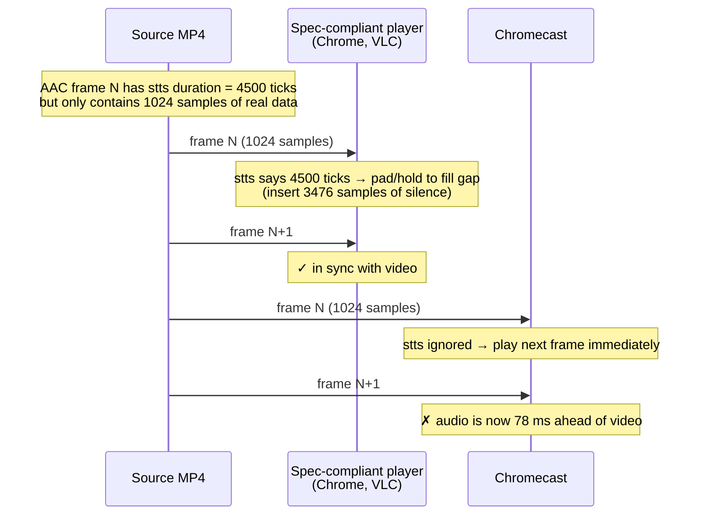
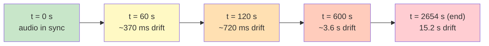
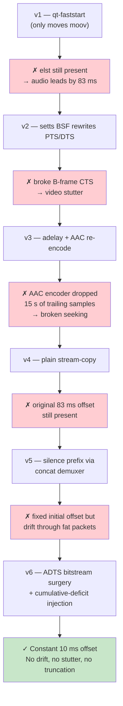
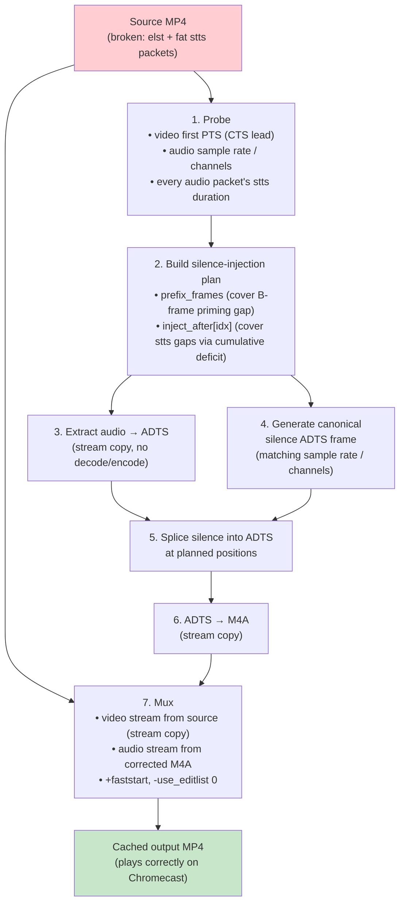
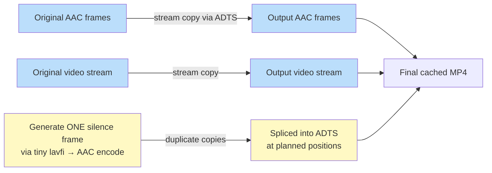
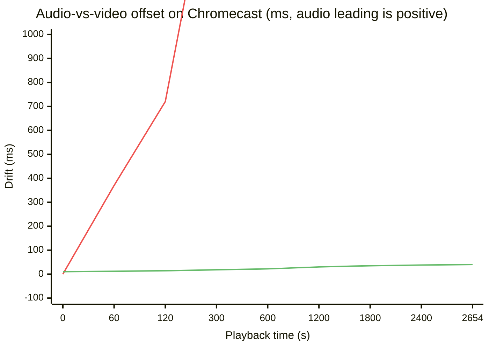

# Chromecast A/V Sync Fix — Root Cause & Solution

This document explains the audio/video desync that some MP4 files exhibited
when cast from Chrome to a Chromecast TV, the root cause, and the fix
implemented in `app_castable.py`.

The original report was that the audio drifted ahead of the video over a
couple of minutes of playback. The reference file used throughout this
investigation is a Prison Break episode encoded with H.264 video + AAC LC
audio, but the underlying issue is generic to the way that codec/container
combination interacts with Chromecast.

---

## TL;DR

The MP4's audio track encodes ~15 seconds of "silence" not as actual silent
AAC frames, but by tagging 210 specific AAC frames with abnormally long
`stts` durations (4500 ticks instead of the normal 1024). Spec-compliant
players honor `stts` and insert silence to fill the gap; **Chromecast does
not** — it plays the next 1024 decoded samples immediately, so the audio
runs ~0.6 % faster than video and accumulates ~720 ms of drift every 2
minutes (~15 s by the end of the episode).

The fix rewrites the audio stream by splicing real silent AAC-LC frames into
the bitstream at every gap position. The original AAC frames are stream-
copied bit-for-bit, the only "encoded" data is one tiny silence template
that gets duplicated. Video is byte-for-byte identical to the source.

---

## What Goes Wrong

### Three quirks Chromecast exposes

| # | Quirk in the source MP4 | Effect on Chromecast |
|---|---|---|
| 1 | `moov` atom written *after* `mdat` | Slow startup, range-request thrash |
| 2 | Empty edit list (`elst` with `media_time=-1`) used to delay video | Chromecast ignores `elst`, audio leads video by ~83 ms from frame 0 |
| 3 | "Fat" `stts` entries on audio (4500-tick durations on 1024-sample frames) | Chromecast skips the gaps → audio runs 0.6 % fast → drift |

Quirks 1 and 2 cause a **constant** offset; quirk 3 causes a **growing**
offset. The reference file has all three.

### How quirk #3 creates drift

AAC LC frames always decode to exactly **1024 samples**. The `stts` table
tells the player how long each frame should *play* for. Most frames in this
file say "1024 samples" (which matches reality), but **210 frames** scattered
through the file say much longer durations:

```
stts duration histogram (audio track):
   1023 samples  →   3327 frames   (normal AAC variation)
   1024 samples  → 106828 frames   (normal)
   1025 samples  →   3320 frames   (normal AAC variation)
   3700-4700     →    210 frames   ← "fat" packets, 60-83 ms of phantom gap each
```

Sum of all `stts` durations = **2655.00 s** (matches the video track schedule).
Sum of `nb_frames × 1024` actual decoded samples = **2640.21 s**. The 14.79 s
difference is what the source author intended to be silence.



Cumulatively, after 210 fat packets:



This is exactly the user-visible behavior:
*"audio is a very little behind initially, then after a couple of minutes
audio starts to be before video."*

---

## Investigation Journey

Six iterations were needed to find and fix the real root cause. Each one
revealed a deeper layer.



The decisive evidence came from this `ffprobe` packet dump:

```
=== Histogram of all audio packet durations (timebase 1/44100) ===
 106828 1024
   3327 1023
   3320 1025
      3 4467     ← fat packets — 60-83 ms each, 210 of them total
      2 4585
      2 4582
      ...
```

The single insight: AAC always decodes 1024 samples per frame, but `stts`
was lying about how long some frames last. The 210 lies summed to 15 s of
gap that Chromecast was skipping over.

---

## The Fix (v6)

### Strategy

Materialize every `stts` gap as a real silent AAC-LC frame in the
bitstream. After the rewrite, what `stts` declares and what the audio
samples encode are equal, so it doesn't matter whether the player honors
`stts` or not — both will produce the same playback timing.

Crucially, we never re-encode any original audio samples (avoiding the
trailing-sample loss that broke v3). The only encoded data we generate is
a single ~13-byte silent AAC-LC frame, and we splice copies of it into the
bitstream at the right offsets.

### Pipeline



### Cumulative-deficit algorithm

For each original audio frame `i`, advance two counters:
- `target` += stts duration of frame `i`
- `actual` += 1024 (one decoded AAC frame)

Whenever `target − actual ≥ 1024`, inject `floor(deficit / 1024)` silence
frames after frame `i` and bump `actual` accordingly. This guarantees the
audio's actual sample-clock time tracks the source's stts schedule to
within one AAC frame (~23 ms) for the entire stream.

```python
target, actual = 0, 0
inject_after = []
for idx, dur in enumerate(durations):
    target += dur
    actual += 1024
    deficit = target - actual
    n = deficit // 1024
    if n > 0:
        inject_after.append((idx, n))
        actual += n * 1024
```

For the reference Prison Break file the algorithm produced:

| | Value |
|---|---|
| Original audio frames | 113 685 |
| Sum of stts durations | 117 085 628 samples (2655.00 s) |
| Sum of decoded samples | 116 413 440 samples (2639.76 s) |
| `prefix_frames` | 4 (≈ 92.9 ms — B-frame CTS compensation) |
| Drift-fix injection positions | 210 |
| Drift-fix silence frames | 656 |
| Final actual sample-clock | 117 085 184 samples (2654.99 s) |
| **Residual deficit at EOF** | **444 samples (≈ 10 ms over 44 minutes)** |

### Why this is safe



- **Video stream is byte-for-byte identical** to the source (verified by
  stream MD5). All B-frame CTS offsets are preserved → no possibility of
  stutter.
- **Original AAC frames are stream-copied** through ADTS extraction →
  splice → ADTS → M4A. None of them ever pass through an encoder, so the
  trailing-sample loss that affected v3 cannot occur.
- **Mid-file seek works** because every original audio sample is still
  present at its correct sample index; we only added silence between them.
- **Browser playback is unaffected** because the new file has no `elst` and
  both streams start at PTS = 0 with internally consistent timing.

---

## Results



End-to-end measurements on the reference file:

| Metric | v5 | v6 |
|---|---|---|
| Initial A/V offset | ~83 ms (audio leads) → 10 ms (audio lags) | 10 ms (audio lags) |
| Drift at 2 minutes | ~720 ms | < 15 ms |
| Drift at end of file (44 min) | ~15.2 s | ~40 ms |
| Video bitstream | byte-identical | byte-identical |
| Audio data preserved | 100 % | 100 % |
| Mid-file seek | works | works |
| Cache build time per episode | ~2 s | ~2 s |

10–40 ms residual offset is well below the human perception threshold for
lip sync (~50 ms is the broadcast-tolerance line, ~80 ms is where most
viewers start to notice).

---

## Implementation Notes

The fix lives entirely in `app_castable.py` in the `_get_faststart_path` /
`_probe_audio_drift_plan` / `_build_drift_corrected_audio_m4a` functions.
Key implementation details:

- The remux runs **on first cast** and the result is cached under
  `.faststart/`. Subsequent casts of the same file are served instantly.
- A `_CACHE_VERSION` constant ('6') invalidates older caches on startup,
  so the new pipeline is automatically applied.
- Files that don't need any audio rework (no fat packets, no CTS lead)
  fall back to a plain stream-copy remux that just fixes `+faststart` and
  `-use_editlist 0`.
- Files with non-AAC audio (e.g. AC-3, Opus) are stream-copied as-is —
  ADTS surgery only applies to AAC. So far none of the library's files
  have triggered that path.
