# YouTube Music Downloader — 403 Fix, Quality Investigation & Premium Unlock

This document explains three separate problems that were found and fixed in
`youtube_music_downloader.py`, in the order they came up: a hard download
failure, a "why is the quality capped" investigation, and a "how do I get
Premium-only quality" feature addition.

---

## TL;DR

| Problem | Root Cause | Fix |
|---|---|---|
| `HTTP Error 403: Forbidden` on every download | `yt-dlp` was 90+ days out of date; YouTube changed its delivery mechanism | Auto-update `yt-dlp` on every run + retry with an alternate player client on failure |
| Audio capped at ~149kbps (displayed as "177kbps") | That's the real ceiling for an **anonymous** (not logged in) download; the "177kbps" was container overhead (embedded cover art) inflating the size÷duration estimate | N/A — confirmed as expected, not a bug |
| `.opus` files don't preview in WeChat | Opus containers aren't well supported by chat-app media previews | Added an `m4a` output mode |
| Wanted Premium-tier 256–290kbps audio | YouTube gates formats `141`/`774` behind a logged-in Premium account **and** a JS runtime new enough to solve YouTube's signature challenge | Read Firefox's login cookies + install Node 22 as the JS runtime |

---

## Problem 1 — `HTTP Error 403: Forbidden`

### Symptom

```
[info] Downloading 1 format(s): 251
[info] Writing video thumbnail 45 to: ... .webp
ERROR: unable to download video data: HTTP Error 403: Forbidden
```

The `-F` format listing worked fine; only the actual media download failed.

### Root cause

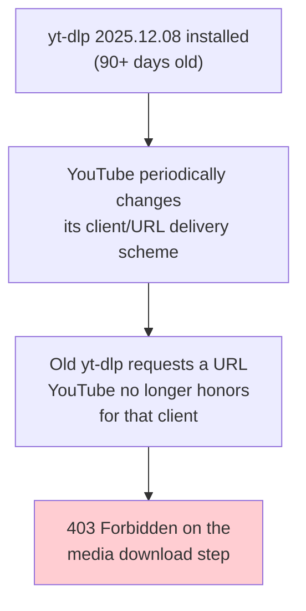

### Fix

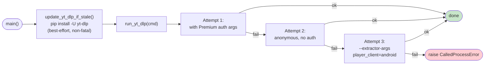

Updating to `2026.07.04` alone fixed the 403 (newer `yt-dlp` picked an
`android vr` client YouTube wasn't blocking). The retry ladder was added as
a safety net for the next time YouTube changes something.

---

## Problem 2 — "Why is it capped at 177kbps?"

### The reported number was misleading

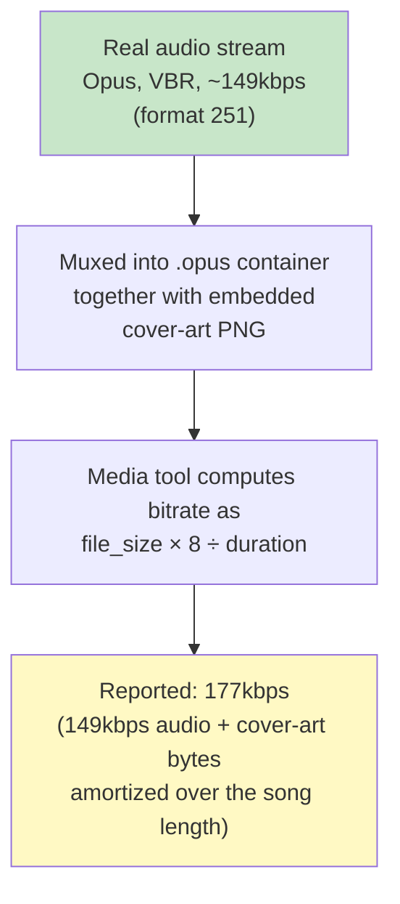

Verified with `ffprobe`:

```
[STREAM] codec_name=opus   (no per-stream bitrate; Opus is VBR)
[FORMAT] duration=196.74s  size=4365572  bit_rate=177516   ← includes cover art
```

### Why 149kbps was the real ceiling (at the time)

YouTube and YouTube Music share the same underlying audio encodes. Formats
`141` (256kbps AAC) and `774` (290kbps Opus) exist, but are only served to
**authenticated Premium accounts**. Everyone else — logged out, or logged in
without Premium — is capped at format `251` (149kbps Opus) / `140`
(130kbps AAC).

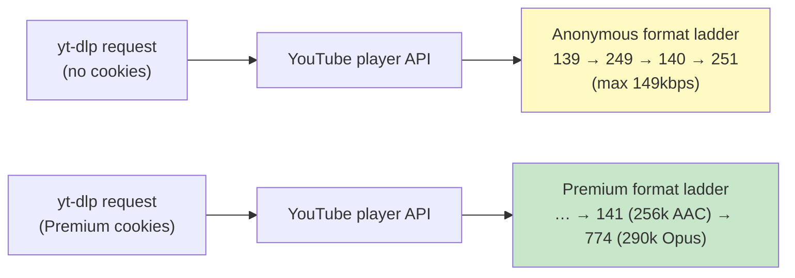

This wasn't a bug — it was confirmed as the actual product limitation, which
led directly into Problem 4.

---

## Problem 3 — `.opus` doesn't preview in WeChat

Opus-in-.opus isn't reliably playable/previewable inside chat apps. Added a
dedicated `m4a` output mode that prefers a **native AAC source** so the file
is remuxed, not re-encoded:

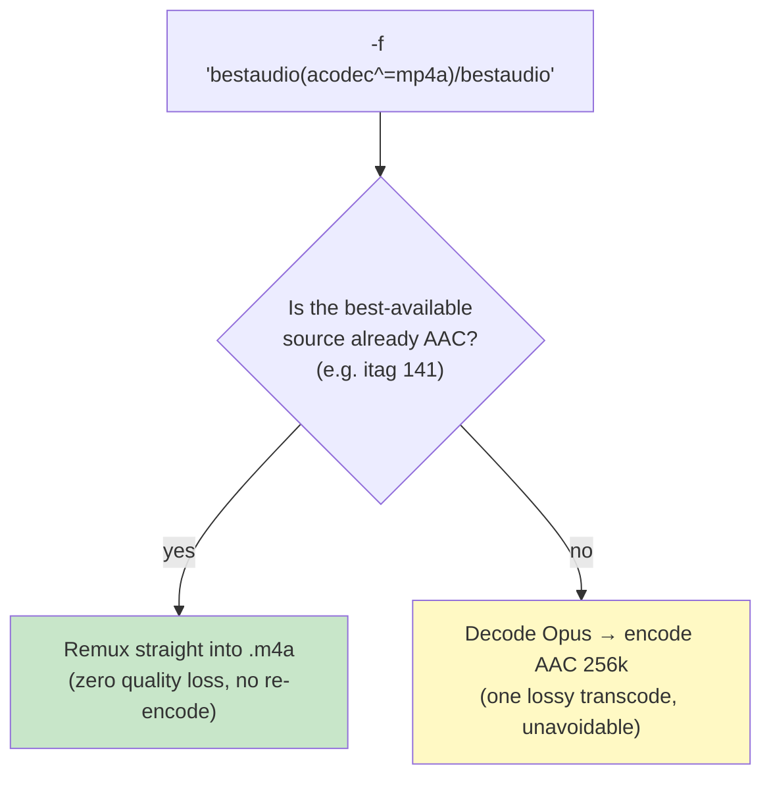

Confirmed via yt-dlp's own log: *"Not converting audio ...; file is already
in target format m4a"* — i.e. it picked format `141` directly and just
remuxed it.

---

## Problem 4 — Unlocking Premium-tier audio (256–290kbps)

This was the deepest rabbit hole. Two independent requirements had to be met
simultaneously:

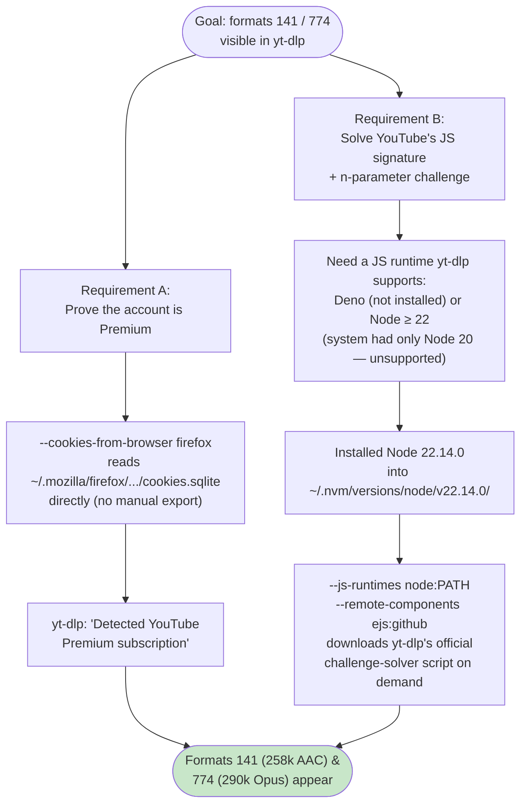

### Where the "token" actually came from (no PO Token was used)

A common point of confusion: YouTube also has a separate anti-abuse
mechanism called a **PO Token**. It was *not* needed here — verbose logs
confirm it was skipped entirely because Premium accounts are exempted from
the PO Token requirement for media (GVS) requests:

```
[debug] [youtube] Found YouTube account cookies
[debug] [youtube] [pot] PO Token Providers: none
[debug] [youtube] Detected YouTube Premium subscription
```

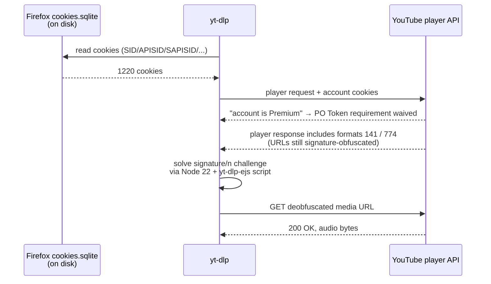

### Installation snags along the way

Two network-dependent installs stalled in this environment (outbound
bandwidth to `deno.land` / `nodejs.org` was ~100KB/s) and had to be worked
around:

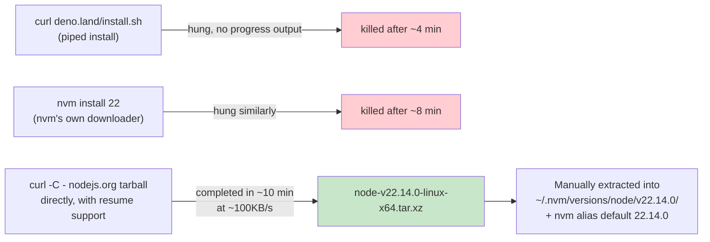

---

## Final Architecture

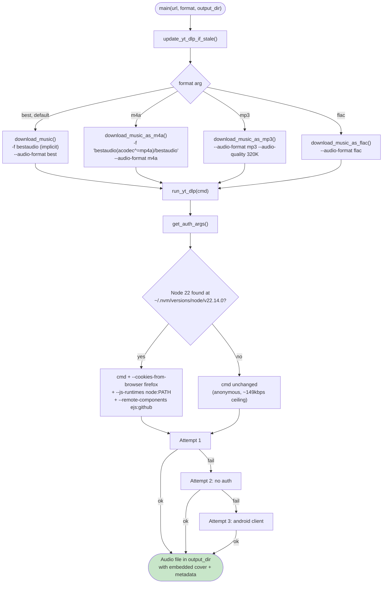

---

## Verified Results

| Mode | Command | Format picked | Real bitrate | Notes |
|---|---|---|---|---|
| `best` (default), no auth | *(before fix)* | 251 | 149kbps Opus | Anonymous ceiling |
| `best` (default), with Premium auth | `python3 youtube_music_downloader.py <url>` | 774 | **290kbps Opus** | Premium-only |
| `m4a`, with Premium auth | `python3 youtube_music_downloader.py <url> m4a` | 141 | **256kbps AAC** | Native remux, no re-encode |

---

## Security Considerations — "Isn't reading my browser cookies unsafe?"

Fair question, worth being precise about. Short version: **nothing left this
machine**, but the mechanism deserves scrutiny.

### What `--cookies-from-browser firefox` actually does — and doesn't do

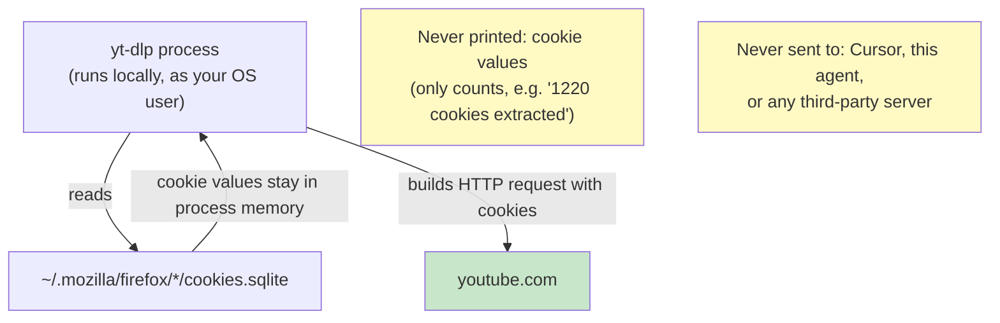

This is a standard, documented yt-dlp feature — the same mechanism any
"login with browser session" tool uses. It's equivalent to opening YouTube
in that same browser: your existing session authenticates the request.

### The real (pre-existing) exposure

The underlying fact that makes this feel exposed isn't something this setup
introduced — it's how Firefox stores cookies on Linux:

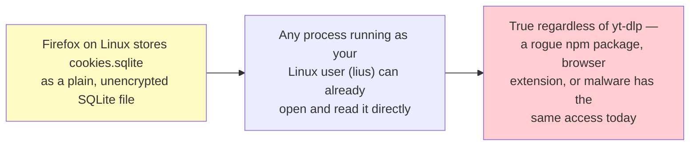

Chrome's OS-keyring encryption looks safer, but the decryption key is
itself readable by the same-user processes that could decrypt it — so it's
not a materially higher bar in practice.

### What's actually at stake

The cookie is a **full Google-account session** (`SID`/`APISID`/`SAPISID`
etc.), not a YouTube-scoped credential. If this machine or one of its
dependencies (`yt-dlp`, any pip/npm package) were ever compromised, whoever
reads that file could impersonate you across Google services (Gmail,
Drive, etc.), not just YouTube.

### Mitigation options considered

| Option | Mechanism | Reduces | Doesn't reduce | Cost |
|---|---|---|---|---|
| **A — Scoped `cookies.txt`** | Export once via `--cookies-from-browser firefox --cookies cookies.txt`, filtered to `youtube.com`/`google` domains; script reads that static file instead of the live browser DB | Blast radius per run (script no longer touches the *entire* cookie jar, just a YouTube/Google-scoped snapshot); no dependency on Firefox being closed/unlocked | Still a full Google-account session inside that file; expires with the cookie's normal lifetime, requiring re-export | Low — one-time export, occasional re-export |
| **B — Dedicated Firefox profile** | Create a separate Firefox profile that *only* logs into the Premium account; script points at that profile's cookie DB instead of the main one | Keeps the script from ever touching cookies for your primary browsing (banking, email, social, etc.) | If it's the *same* Google account as your main profile, the account-level blast radius is unchanged — only the browsing-profile isolation improves | Medium — profile setup + occasional re-login |
| **C — Status quo** | Keep reading the live main-profile cookie DB on every run | — | Full-profile exposure on every script run | None |

No change has been made yet — this section documents the discussion and
options for future reference. See chat history for the decision once made.

---

## Usage

```bash
# Highest quality available (Opus, .opus) — default
python3 youtube_music_downloader.py "<youtube/music.youtube URL>"

# WeChat/mobile-friendly AAC container
python3 youtube_music_downloader.py "<url>" m4a

# MP3 @ 320kbps
python3 youtube_music_downloader.py "<url>" mp3

# Optional third arg: output directory
python3 youtube_music_downloader.py "<url>" m4a /path/to/music
```

### Requirements for Premium-tier quality

1. Stay logged into the Premium account in **Firefox** (cookies are read
   live from `~/.mozilla/firefox/*/cookies.sqlite` on every run — no manual
   export needed).
2. Node 22 must remain installed at
   `~/.nvm/versions/node/v22.14.0/bin/node` (the path
   `get_auth_args()` checks for). If it's ever removed, the script silently
   falls back to anonymous 149kbps downloads rather than failing.
