# Custom Android devices: CSR / PKI / DUC / mTLS / CN fields

> Goal: use an ID-card analogy to see what **CSR, PKI, and DUC** do when a **custom Android device authenticates to a backend**, and after the request hits **k3s**, which hop **Traefik, Envoy, and typical microservices** sit on — and in what order they see the certificate CN.

Chinese original: [`android-device-pki-mtls.md`](./android-device-pki-mtls.md)

---

## 0. One chain

```
Device generates a private key in the TEE (on-chip vault)  →  fills a CSR (application form) with the public key
        ↓
PKI (your CA) reviews and stamps  →  returns this machine's DUC (device ID card)
        ↓
Every later backend call, both sides show certs during TLS  =  mTLS (door check, usually at Traefik)
        ↓
Traefik extracts CN headers → (optional Envoy ext_authz) → device-auth parses fields → business microservices
```

**The private key never leaves the device. The backend never sees the private key. The backend only sees the printed text on an already-stamped ID card.**

**Contents**

0. [One chain](#0-one-chain)
1. [CSR / PKI / DUC](#1-what-the-three-terms-are)
2. [CN ≠ DNS CNAME](#2-what-is-printed-on-the-cert-cn--dns-cname)
3. [Enroll vs present](#3-two-lifecycles-enroll-first-then-present)
4. [Where mTLS sits](#4-which-layer-mtls-lives-on-layers-first-components-next)
5. [Where k3s / Traefik / Envoy / microservices sit](#5-typical-architecture-where-components-sit-on-k3s)
6. [Hop order of one request](#6-real-order-of-one-business-request-hop-by-hop)
7. [Factory to first API](#7-end-to-end-sequence-factory-to-first-business-api-on-k3s)
8. [How the backend parses CN](#8-how-the-backend-parses-fields-in-the-cn)
9. [TEE / Keystore / StrongBox](#9-what-tee-is-where-keys-actually-live-on-the-device)
10. [Stacking user login](#10-how-this-stacks-with-user-login)
11. [Cheat sheet](#11-cheat-sheet-so-the-terms-do-not-blur)
12. [Common mix-ups](#12-common-mix-ups)
13. [Sentences you should be able to say](#13-sentences-you-should-be-able-to-say)
14. [Local end-to-end mimic](#14-local-end-to-end-mimic-traefik--dummy-duc--k3s)

---

## 1. What the three terms are

| Term | Full name (this design) | What it is | What it is not |
|---|---|---|---|
| **CSR** | Certificate Signing Request | The device's "please issue me a cert" form. It carries the public key plus identity fields you want printed, signed with the private key to prove "I hold this key". | Not a login credential. Until a CA stamps it, a CSR cannot talk to production. |
| **PKI** | Public Key Infrastructure | The whole issue / revoke / verify system: root CA, intermediate CA, policy, CRL/OCSP, cert templates. | Not one HTTPS call. Not Android itself. It is the stamp office. |
| **DUC** | Device Unique Certificate | After PKI signs, **this device's own client certificate**. That is what mTLS presents at runtime. | Not the private key. Not a user account. Not the server certificate. |
| **TEE** | Trusted Execution Environment | Isolated on-chip vault beside ordinary Android: the private key is born and signs here; the bytes never come out. Details in [§9](#9-what-tee-is-where-keys-actually-live-on-the-device). | Not a cert, not a gateway, not Keystore. k3s / Traefik never see it. |

> Some teams write Device Unique Credential / Device Unique Cert. Same idea: **one cert per machine, bound to that machine's public key**.  
> **Keystore is the counter, TEE is the vault, DUC is the photocopy taped on the vault door.**

How the three connect:

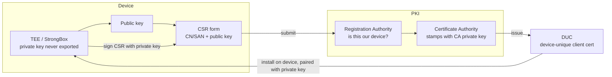
```mermaid
flowchart LR
    subgraph Device
        K[TEE / StrongBox<br/>private key never exported]
        PUB[Public key]
        CSR[CSR form<br/>CN/SAN + public key]
        K --> PUB --> CSR
        K -->|sign CSR with private key| CSR
    end

    subgraph PKI
        RA[Registration Authority<br/>is this our device?]
        CA[Certificate Authority<br/>stamps with CA private key]
        RA --> CA
    end

    DUC[DUC<br/>device-unique client cert]

    CSR -->|submit| RA
    CA -->|issue| DUC
    DUC -->|install on device, paired with private key| K
```

---

## 2. What is printed on the cert: CN ≠ DNS CNAME

When people say "parse the fields in the cname", on this path that is **almost always the certificate Subject CN (Common Name)**, sometimes plus SAN.  
It is **not** a DNS CNAME (`foo.example.com CNAME bar.cdn.net`).

Two different things:

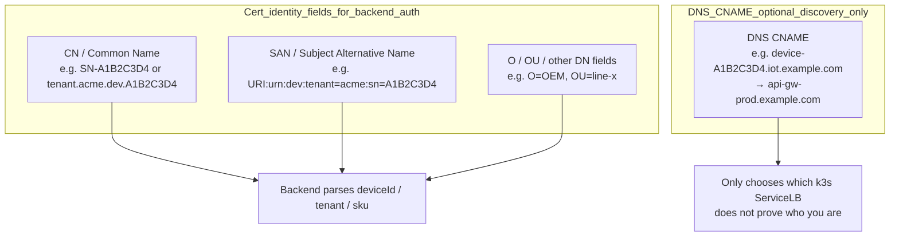
```mermaid
flowchart TB
    subgraph Cert_identity_fields_for_backend_auth
        CN["CN / Common Name<br/>e.g. SN-A1B2C3D4 or tenant.acme.dev.A1B2C3D4"]
        SAN["SAN / Subject Alternative Name<br/>e.g. URI:urn:dev:tenant=acme:sn=A1B2C3D4"]
        O["O / OU / other DN fields<br/>e.g. O=OEM, OU=line-x"]
    end

    subgraph DNS_CNAME_optional_discovery_only
        DNS["DNS CNAME<br/>e.g. device-A1B2C3D4.iot.example.com<br/>→ api-gw-prod.example.com"]
    end

    CN --> AUTH[Backend parses deviceId / tenant / sku]
    SAN --> AUTH
    O --> AUTH
    DNS --> ROUTE[Only chooses which k3s ServiceLB<br/>does not prove who you are]
```

### 2.1 How fields are usually encoded

When the CSR is built, the device (or factory tool) writes identity into Subject / SAN. Three common patterns:

```text
# Pattern A: serial in CN
CN=SN-A1B2C3D4, OU=custom-pad, O=YourOEM

# Pattern B: dotted CN, backend splits
CN=acme.prod.pad.A1B2C3D4
     │    │    │    └── deviceId
     │    │    └── product line
     │    └── environment
     └── tenant

# Pattern C: CN is human-readable; real identity in SAN (cleaner)
CN=CustomPad-A1B2C3D4
SAN URI = urn:device:tenant=acme:env=prod:sku=pad:sn=A1B2C3D4
SAN DNS = A1B2C3D4.devices.internal
```

Those are the strings the backend parses. **They are trustworthy because mTLS already proved: this cert was signed by your CA, and the peer holds the matching private key.**  
Without mTLS, CN is just text anyone can forge.

---

## 3. Two lifecycles: enroll first, then present

A custom Android talking to the backend is **two timelines**. Do not mash them into one HTTP call.

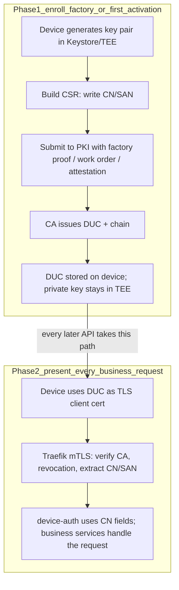
```mermaid
flowchart TB
    subgraph Phase1_enroll_factory_or_first_activation
        A1[Device generates key pair in Keystore/TEE]
        A2[Build CSR: write CN/SAN]
        A3[Submit to PKI with factory proof / work order / attestation]
        A4[CA issues DUC + chain]
        A5[DUC stored on device; private key stays in TEE]
        A1 --> A2 --> A3 --> A4 --> A5
    end

    subgraph Phase2_present_every_business_request
        B1[Device uses DUC as TLS client cert]
        B2[Traefik mTLS: verify CA, revocation, extract CN/SAN]
        B3[device-auth uses CN fields; business services handle the request]
        B1 --> B2 --> B3
    end

    A5 -->|every later API takes this path| B1
```

- Phase 1 can be factory tooling, an activation code, EST/SCEP, or a homegrown `/enroll`.
- Phase 2 is "device talks to backend". mTLS only happens in the Phase 2 **TLS handshake**, not in the JSON body.

---

## 4. Which layer mTLS lives on (layers first, components next)

### 4.0 TLS vs mTLS: not "devices vs browsers"

**mTLS is not a different protocol, and not "TLS for devices".**  
mTLS = **mutual TLS** = the same TLS handshake, but **both sides present a certificate**.  
Everyday HTTPS / TLS is **one-way**: only the server shows a server cert; the client is anonymous at the TLS layer.

| | Plain TLS (typical HTTPS) | mTLS |
|---|---|---|
| Who presents a cert | **Server only** (`api.example.com`) | **Server + client** |
| Who the client is at TLS | Anonymous. Identity comes later via cookie / password / OAuth | Already a client cert (here, the DUC) |
| Who can use it | Browsers, apps, devices, curl | Same list, if they have a client cert |
| In this design | Humans in a browser hitting an admin UI | Custom Android → Traefik with a DUC |

So:

- Browsers can do mTLS (intranet PKI, bank tokens, Chrome's "choose a certificate" prompt).
- Devices can use plain TLS + a token and never touch mTLS.
- The split is **whether TLS requires a client cert**, not whether the client is a phone or Chrome.

This design uses mTLS because each custom Android has a TEE private key + DUC, which is a good way to prove *which machine* this is at handshake time. Operators logging into an admin UI in a browser usually **do not** need that DUC path.

mTLS = **Mutual TLS**: **both sides present certificates** during the handshake.

| Direction | Who presents | Cert type | Peer checks |
|---|---|---|---|
| Server → device | Traefik cert for `api.example.com` | Server cert | Device: is this `api.example.com`, is the chain trusted |
| Device → server | **DUC** | Client cert | **Traefik**: signed by your CA, not revoked, EKU allows clientAuth |

It happens **before HTTP**. On k3s, **Traefik** does this hop by default. Business pods never see the raw handshake; they only get forwarded headers.

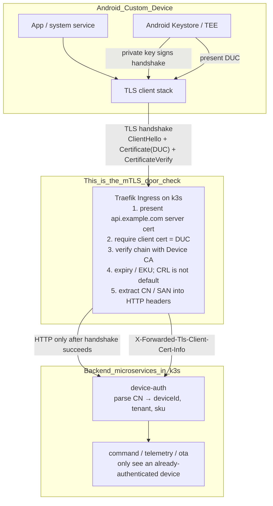
```mermaid
flowchart TB
    subgraph Android_Custom_Device
        APP[App / system service]
        KS[Android Keystore / TEE]
        TLS_C[TLS client stack]
        APP --> TLS_C
        KS -->|private key signs handshake| TLS_C
        KS -->|present DUC| TLS_C
    end

    subgraph This_is_the_mTLS_door_check
        LB["Traefik Ingress on k3s<br/>1. present api.example.com server cert<br/>2. require client cert = DUC<br/>3. verify chain with Device CA<br/>4. expiry / EKU; CRL is not default<br/>5. extract CN / SAN into HTTP headers"]
    end

    subgraph Backend_microservices_in_k3s
        AUTH[device-auth<br/>parse CN → deviceId, tenant, sku]
        BIZ[command / telemetry / ota<br/>only see an already-authenticated device]
    end

    TLS_C -->|"TLS handshake<br/>ClientHello + Certificate(DUC) + CertificateVerify"| LB
    LB -->|HTTP only after handshake succeeds| AUTH
    LB -->|"X-Forwarded-Tls-Client-Cert-Info"| AUTH
    AUTH --> BIZ
```

Where a diagram still says `X-Client-CN`, that is shorthand. The header Traefik writes — and deletes if the client forged it — is `X-Forwarded-Tls-Client-Cert-Info`. device-auth reads that. Do not read `X-Client-CN` (Traefik neither writes nor deletes it).

### 4.1 Layers bottom to top

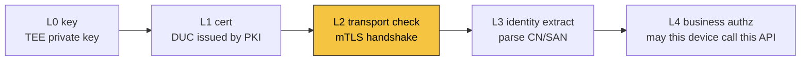
```mermaid
flowchart LR
    L0[L0 key<br/>TEE private key] --> L1[L1 cert<br/>DUC issued by PKI]
    L1 --> L2[L2 transport check<br/>mTLS handshake]
    L2 --> L3[L3 identity extract<br/>parse CN/SAN]
    L3 --> L4[L4 business authz<br/>may this device call this API]

    style L2 fill:#f5c542,stroke:#333,color:#000
```

The yellow layer is mTLS.  
CSR / PKI finish before L1.  
"Parse CN fields" is L3.  
User login, tokens, and business permissions are L4. They can stack on the device cert; they cannot replace mTLS.

### 4.2 Where TLS terminates: nginx as a map, k3s is Traefik

mTLS happens at the cluster door, not inside Spring/Django. Left column is the nginx directive you would look for; right column is the same job on k3s's default Ingress (Traefik). The header names differ.

| nginx | k3s / Traefik | Job |
|---|---|---|
| `ssl_client_certificate` | Secret `device-ca`, key must be `ca.crt` | Install the Device CA |
| `ssl_verify_client on` | `TLSOption` `RequireAndVerifyClientCert` | No valid DUC, no HTTP |
| `proxy_set_header X-SSL-Client-CN` | `passTLSClientCert` → `X-Forwarded-Tls-Client-Cert-Info` | Hand the CN to downstream |

nginx is only the map. This design does not run nginx:

```nginx
ssl_verify_client on;
ssl_client_certificate /etc/pki/device-ca-chain.pem;
proxy_set_header X-SSL-Client-CN $ssl_client_s_dn_cn;
```

On k3s, three objects (full fields in [§6.2.1](#621-which-ca-traefik-needs-and-where-you-put-it)):

```yaml
# 1. Device CA. No Traefik container args, no PEM mount into the Traefik pod
# kubectl -n device-platform create secret generic device-ca --from-file=ca.crt=pki/device-ca.crt
---
apiVersion: traefik.io/v1alpha1
kind: TLSOption
metadata:
  name: mtls
  namespace: device-platform
spec:
  clientAuth:
    secretNames: [device-ca]
    clientAuthType: RequireAndVerifyClientCert
---
apiVersion: traefik.io/v1alpha1
kind: Middleware
metadata:
  name: pass-client-cert
  namespace: device-platform
spec:
  passTLSClientCert:
    pem: false
    info:
      sans: true
      subject:
        commonName: true
---
# 2. Attach on the business IngressRoute. Do not attach this TLSOption on /enroll
# spec.tls.secretName: api-tls          ← Traefik's own server cert
# spec.tls.options.name: mtls
# spec.routes[].middlewares: pass-client-cert
```

Downstream reads the CN inside `X-Forwarded-Tls-Client-Cert-Info`, then `split('.')`. Do not read nginx's `X-SSL-Client-*`: Traefik does not write those.

The next section splits this "gateway" into the real k3s pieces: Traefik, Envoy, Service, typical microservices.

---

## 5. Typical architecture: where components sit on k3s

Thinking of "the backend" as one box gets you lost. A real deploy is almost always:

- **k3s** = the cluster OS. It is **not** a hop on the request path. It is **where** Traefik / Envoy / microservices run.
- **Traefik** = k3s default Ingress Controller. After the device comes in from the public network, **the first L7 component that can do mTLS is usually Traefik**.
- **Envoy** = a more general L7 proxy. Second-hop API gateway, or a sidecar next to each microservice (east-west mTLS). It is **not installed with k3s** by default; you add it.
- **Typical microservices** = pods behind ClusterIP. They almost never handshake with Android. They consume headers Traefik/Envoy forwarded.

### 5.1 North-south vs east-west

The device DUC appears only **north-south** (device → cluster door).  
If services inside the cluster also do mTLS, that is **a different cert set** (mesh / SPIFFE), not the device DUC.

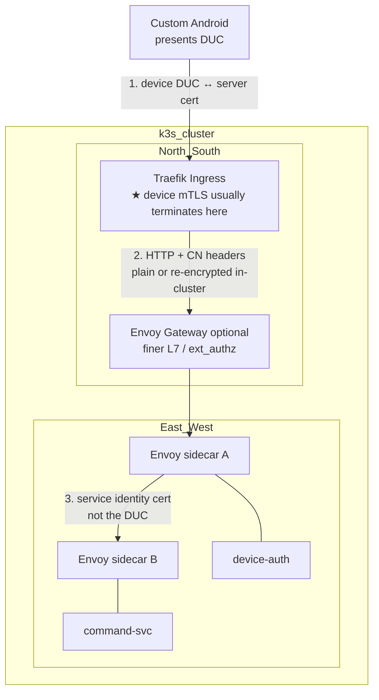
```mermaid
flowchart TB
    DEV[Custom Android<br/>presents DUC]

    subgraph k3s_cluster
        subgraph North_South
            TRAEFIK["Traefik Ingress<br/>★ device mTLS usually terminates here"]
            ENVOY_GW["Envoy Gateway optional<br/>finer L7 / ext_authz"]
        end

        subgraph East_West
            SIDECAR_A[Envoy sidecar A]
            SIDECAR_B[Envoy sidecar B]
            MS_A[device-auth]
            MS_B[command-svc]
            SIDECAR_A --- MS_A
            SIDECAR_B --- MS_B
        end
    end

    DEV -->|"1. device DUC ↔ server cert"| TRAEFIK
    TRAEFIK -->|2. HTTP + CN headers<br/>plain or re-encrypted in-cluster| ENVOY_GW
    ENVOY_GW --> SIDECAR_A
    SIDECAR_A -->|"3. service identity cert<br/>not the DUC"| SIDECAR_B
```

Read the diagram as: **the DUC is handed over at the door; inside, a different identity runs.**

### 5.2 Where each piece sits (one map)

Typical placement for this design. k3s ships the left-hand infra; you deploy the right-hand business.

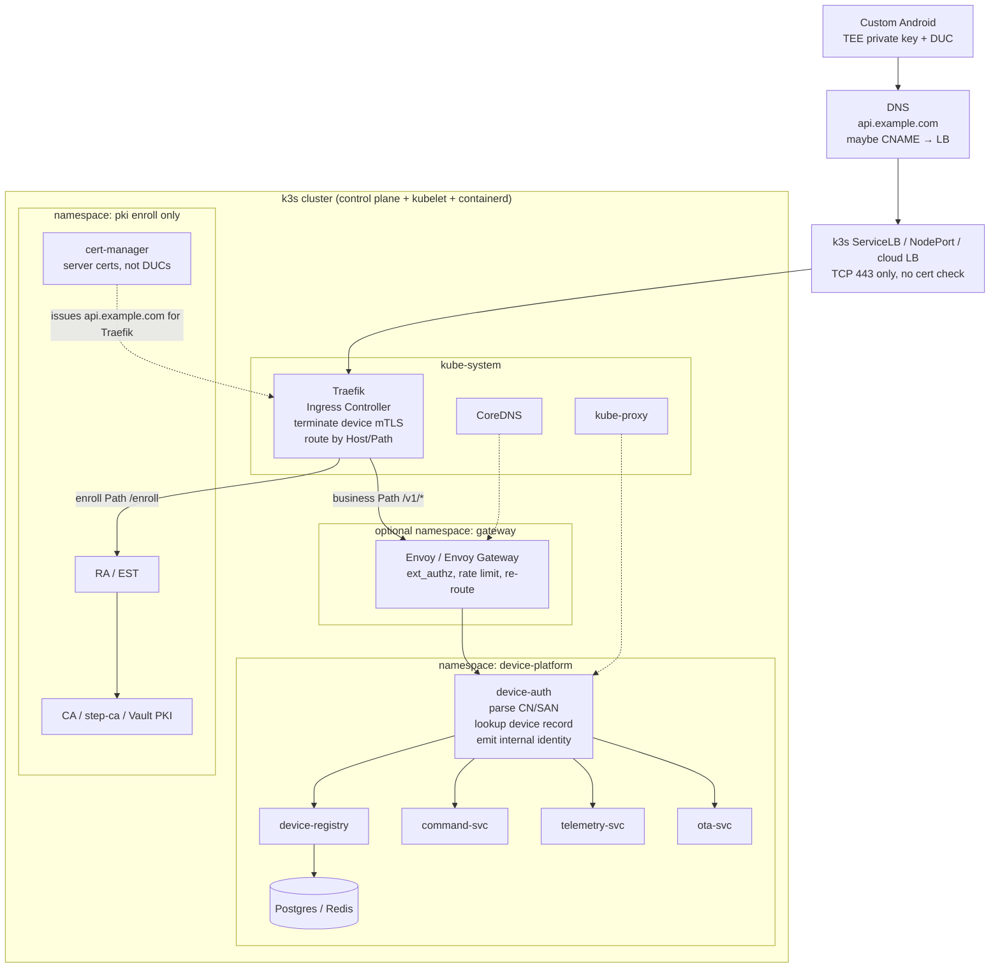
```mermaid
flowchart TB
    DEV[Custom Android<br/>TEE private key + DUC]

    DNS["DNS<br/>api.example.com<br/>maybe CNAME → LB"]
    LB["k3s ServiceLB / NodePort / cloud LB<br/>TCP 443 only, no cert check"]

    subgraph k3s["k3s cluster (control plane + kubelet + containerd)"]
        subgraph kube_system["kube-system"]
            TRAEFIK["Traefik<br/>Ingress Controller<br/>terminate device mTLS<br/>route by Host/Path"]
            COREDNS[CoreDNS]
            KP[kube-proxy]
        end

        subgraph ns_edge["optional namespace: gateway"]
            ENVOY["Envoy / Envoy Gateway<br/>ext_authz, rate limit, re-route"]
        end

        subgraph ns_app["namespace: device-platform"]
            AUTH["device-auth<br/>parse CN/SAN<br/>lookup device record<br/>emit internal identity"]
            REG["device-registry"]
            CMD["command-svc"]
            TEL["telemetry-svc"]
            OTA["ota-svc"]
            DB[(Postgres / Redis)]
        end

        subgraph ns_pki["namespace: pki  enroll only"]
            RA[RA / EST]
            CA[CA / step-ca / Vault PKI]
            CM[cert-manager<br/>server certs, not DUCs]
        end
    end

    DEV --> DNS --> LB --> TRAEFIK
    TRAEFIK -->|"business Path /v1/*"| ENVOY
    TRAEFIK -->|"enroll Path /enroll"| RA
    ENVOY --> AUTH
    AUTH --> REG
    AUTH --> CMD
    AUTH --> TEL
    AUTH --> OTA
    REG --> DB
    RA --> CA
    CM -.->|issues api.example.com for Traefik| TRAEFIK
    COREDNS -.-> ENVOY
    KP -.-> AUTH
```

What each thing does — and does **not** do:

| Component | Role on the request path | Touches the device DUC? | Typical install |
|---|---|---|---|
| **k3s** | Schedules pods, Services/DNS, mounts cert Secrets | Not directly | The `k3s` process on the node |
| **ServiceLB / NodePort** | `nodeIP:443` → Traefik | No verify, TCP only | k3s klipper-lb, or an external LB |
| **Traefik** | **North-south TLS termination + Ingress routing**. Verify DUC, extract CN, split by Host/Path | **Primary DUC verification** | `kube-system` Deployment/DaemonSet, ships with k3s |
| **Envoy** | Optional second hop: `ext_authz` to device-auth, finer routing, or sidecar east-west mTLS | Edge Envoy can re-read headers Traefik set; sidecar does **not** see the DUC | You add it: Envoy Gateway / Contour / Istio |
| **CoreDNS** | In-cluster `device-auth.device-platform.svc` | No | Ships with k3s |
| **kube-proxy** | ClusterIP → Endpoints/Pod | No | Ships with k3s |
| **device-auth** | Trusts Traefik/Envoy headers, parses CN, looks up registry, emits internal identity | Headers only, no handshake | Business namespace |
| **device-registry / command / telemetry** | Typical microservices. Trust internal identity only | No | Business namespace |
| **PKI RA/CA** | Enroll / rotate only; issues DUC | Issues DUC, not on every business request | Separate namespace, isolate from business |
| **cert-manager** | Issues the **server cert** for `api.example.com` | Does not handle device DUCs | Often paired with Traefik |

### 5.2.1 What it looks like on a k3s node

Logical diagrams make Traefik look like a box outside the cluster. Physically it is just pods:

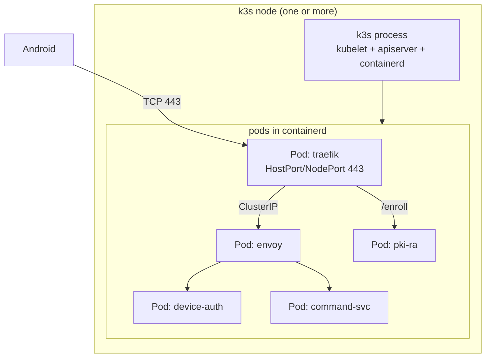
```mermaid
flowchart TB
    subgraph Node["k3s node (one or more)"]
        K3S[k3s process<br/>kubelet + apiserver + containerd]

        subgraph Pods["pods in containerd"]
            T[Pod: traefik<br/>HostPort/NodePort 443]
            E[Pod: envoy]
            A[Pod: device-auth]
            C[Pod: command-svc]
            P[Pod: pki-ra]
        end

        K3S --> Pods
    end

    DEV[Android] -->|TCP 443| T
    T -->|ClusterIP| E
    E --> A
    E --> C
    T -->|/enroll| P
```

The request does not go "through k3s" as L7. k3s only schedules the pods and wires Service iptables/ipvs. Bytes are handled by Traefik / Envoy / microservice containers.

### 5.3 How Traefik and Envoy split work (two typical shapes)

k3s ships Traefik. Envoy is optional. Pick one shape.

**Shape A — smallest typical (most common): device mTLS only at Traefik**

```text
Android  --mTLS-->  Traefik  --HTTP+CN headers-->  device-auth  -->  other services
```

Fits: modest device count, simple routing, team already on k3s Ingress.

**Shape B — common in production: Traefik at the door, Envoy for auth orchestration**

```text
Android  --mTLS-->  Traefik  --HTTP+cert-info headers-->  Envoy
                                                    └─ ext_authz --> device-auth
                                                    └─ on OK forward --> command / telemetry ...
```

Fits: split "verify the cert" from "may this device call this API"; put rate limits, canaries, sku routing on Envoy.

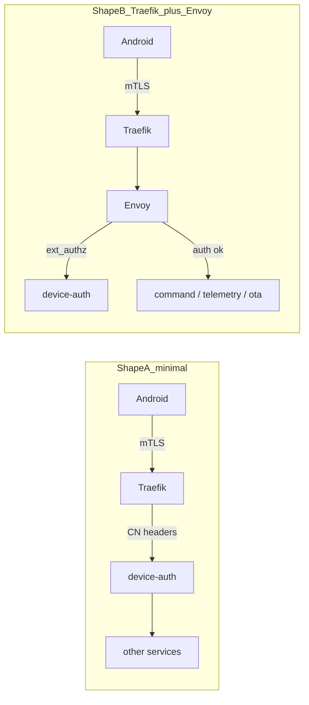
```mermaid
flowchart LR
    subgraph ShapeA_minimal
        A1[Android] -->|mTLS| A2[Traefik] -->|CN headers| A3[device-auth] --> A4[other services]
    end

    subgraph ShapeB_Traefik_plus_Envoy
        B1[Android] -->|mTLS| B2[Traefik] --> B3[Envoy]
        B3 -->|ext_authz| B4[device-auth]
        B3 -->|auth ok| B5[command / telemetry / ota]
    end
```

Do not `require_client_certificate` in both places. After Traefik terminates TLS, downstream is HTTP. Envoy never sees the raw DUC again, only CN/SAN in headers. That is expected.

### 5.4 How to slice typical microservices

Device backends are rarely a monolith. A minimal useful set:

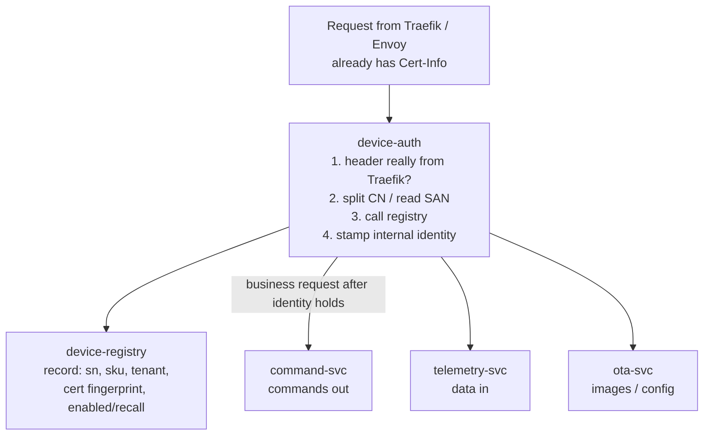
```mermaid
flowchart TB
    IN[Request from Traefik / Envoy<br/>already has Cert-Info]

    AUTH[device-auth<br/>1. header really from Traefik?<br/>2. split CN / read SAN<br/>3. call registry<br/>4. stamp internal identity]

    REG[device-registry<br/>record: sn, sku, tenant,<br/>cert fingerprint, enabled/recall]

    CMD[command-svc<br/>commands out]
    TEL[telemetry-svc<br/>data in]
    OTA[ota-svc<br/>images / config]

    IN --> AUTH
    AUTH --> REG
    AUTH -->|business request after identity holds| CMD
    AUTH --> TEL
    AUTH --> OTA
```

| Service | Sync vs async | Relation to the cert |
|---|---|---|
| device-auth | Sync on every request | **The only service that should parse CN** (or Envoy ext_authz calling it) |
| device-registry | Sync read from auth; async writes for provision/revoke | **Postgres device dossier**: fingerprint ↔ business device id (Redis on the hot path) |
| command / telemetry / ota | Business | Trust identity issued by auth; do not parse CN again |

Rule: **parse CN once**. Other services should not each split the string.

---

## 6. Real order of one business request (hop-by-hop)

Shape B, device calls `POST https://api.example.com/v1/telemetry`.  
Numbers are order. k3s itself is not a hop.

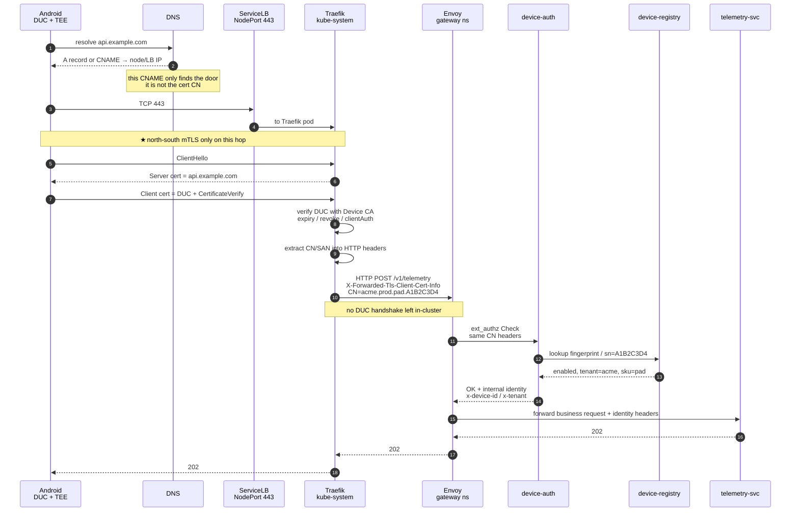
```mermaid
sequenceDiagram
    autonumber
    participant Dev as Android<br/>DUC + TEE
    participant DNS as DNS
    participant SLB as ServiceLB<br/>NodePort 443
    participant Tr as Traefik<br/>kube-system
    participant Ey as Envoy<br/>gateway ns
    participant Auth as device-auth
    participant Reg as device-registry
    participant Tel as telemetry-svc

    Dev->>DNS: resolve api.example.com
    DNS-->>Dev: A record or CNAME → node/LB IP
    Note over DNS: this CNAME only finds the door<br/>it is not the cert CN

    Dev->>SLB: TCP 443
    SLB->>Tr: to Traefik pod

    Note over Dev,Tr: ★ north-south mTLS only on this hop
    Dev->>Tr: ClientHello
    Tr-->>Dev: Server cert = api.example.com
    Dev->>Tr: Client cert = DUC + CertificateVerify
    Tr->>Tr: verify DUC with Device CA<br/>expiry / revoke / clientAuth
    Tr->>Tr: extract CN/SAN into HTTP headers

    Tr->>Ey: HTTP POST /v1/telemetry<br/>X-Forwarded-Tls-Client-Cert-Info<br/>CN=acme.prod.pad.A1B2C3D4
    Note over Tr,Ey: no DUC handshake left in-cluster

    Ey->>Auth: ext_authz Check<br/>same CN headers
    Auth->>Reg: lookup fingerprint / sn=A1B2C3D4
    Reg-->>Auth: enabled, tenant=acme, sku=pad
    Auth-->>Ey: OK + internal identity<br/>x-device-id / x-tenant

    Ey->>Tel: forward business request + identity headers
    Tel-->>Ey: 202
    Ey-->>Tr: 202
    Tr-->>Dev: 202
```

Mapped to layers:

```text
L2  mTLS handshake       Traefik  ↔ Android
L3  extract CN           Traefik  (writes X-Forwarded-Tls-Client-Cert-Info)
L3' interpret CN + lookup device-auth  (called from Envoy ext_authz)
L4  business authz/work  telemetry-svc / command-svc
```

Shape A drops the Envoy hop: Traefik sends the CN-header request straight to device-auth, which then reverse-proxies or lets the client hit other services. Order becomes `1 DNS → 2 LB → 3 Traefik(mTLS) → 4 device-auth → 5 business service`.

### 6.1 Enrollment uses a different Path (keep it off the business route)

CSR submit **still enters the same k3s**, but a different Ingress rule. Do not require an already-issued DUC (chicken and egg). Typical proofs: factory credential / one-shot bootstrap cert / activation code.

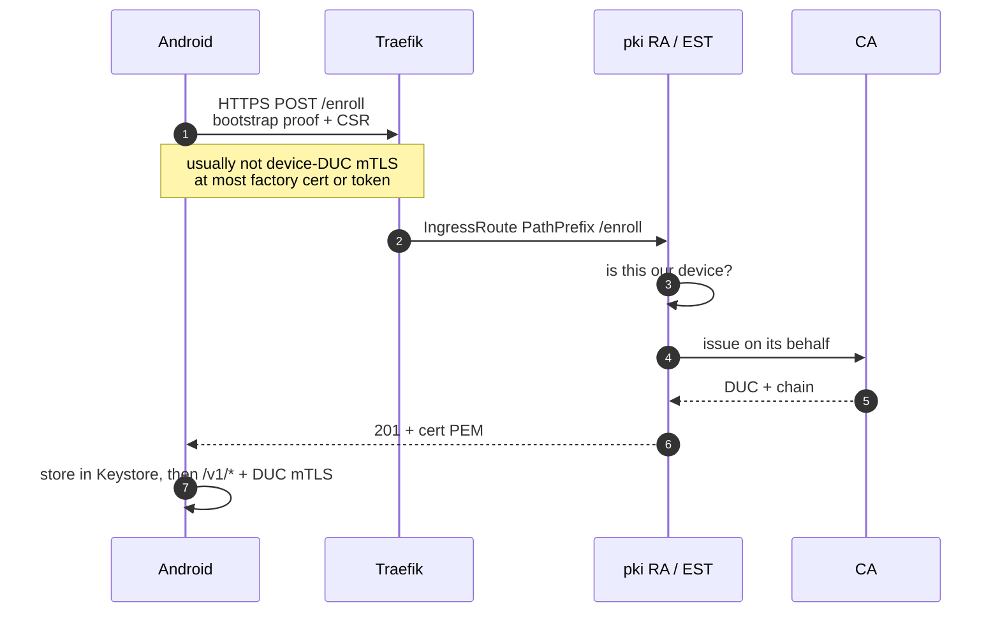
```mermaid
sequenceDiagram
    autonumber
    participant Dev as Android
    participant Tr as Traefik
    participant RA as pki RA / EST
    participant CA as CA

    Dev->>Tr: HTTPS POST /enroll<br/>bootstrap proof + CSR
    Note over Dev,Tr: usually not device-DUC mTLS<br/>at most factory cert or token
    Tr->>RA: IngressRoute PathPrefix /enroll
    RA->>RA: is this our device?
    RA->>CA: issue on its behalf
    CA-->>RA: DUC + chain
    RA-->>Dev: 201 + cert PEM
    Dev->>Dev: store in Keystore, then /v1/* + DUC mTLS
```

Two Traefik routes, same door, different policy:

```text
Host(api.example.com) && PathPrefix(`/enroll`)  →  pki-ra:8080     DUC not required
Host(api.example.com) && PathPrefix(`/v1`)      →  envoy:8080      require device DUC
```

### 6.2 Traefik / Envoy forwarding CN (conceptual config)

Traefik (Ingress door, **verify DUC + extract fields**):

```yaml
# Conceptual; field names vary slightly by Traefik version
tls:
  options:
    device-mtls:
      clientAuth:
        caFiles:
          - /pki/device-ca.pem      # Device CA, not Server CA
        clientAuthType: RequireAndVerifyClientCert

# passTLSClientCert middleware: put Subject/CN into downstream headers
```

Envoy (second hop, **DUC already gone**, ext_authz only):

```yaml
# Conceptual
http_filters:
  - name: envoy.filters.http.ext_authz
    typed_config:
      grpc_service:
        envoy_grpc:
          cluster_name: device-auth
# Forward X-Forwarded-Tls-Client-Cert-Info from Traefik unchanged to device-auth
```

device-auth still only does the later "parse CN" `split('.')` / registry lookup. It does not implement TLS.

### 6.2.1 Which CA Traefik needs, and where you put it

Yes. Traefik must hold the **Device CA cert that issued the DUCs** (the public PEM) as the client-mTLS trust anchor. Do not put the Device CA private key there. Do not put the Server CA in `clientAuth`.

The two CAs are **two different Traefik knobs**:

| What | Role | Where |
|---|---|---|
| **Device CA** | Verify the DUC the device presents | `clientAuth` (`TLSOption` on k3s; `caFiles` in compose) |
| **api.example.com server cert** | The cert Traefik shows the device (signed by Server CA) | IngressRoute `tls.secretName` / compose `tls.certificates` |

Default k3s Traefik needs **no extra container args** and no manual PEM mount into the Traefik pod. Three Kubernetes objects: Secret → TLSOption → IngressRoute references it. In the lab: `local-mtls-lab/k8s/resources.yaml` + `k3d-up.sh`.

**1. Secret holding the Device CA cert** (key must be `ca.crt`; that is the name Traefik looks up):

```bash
kubectl -n device-platform create secret generic device-ca \
  --from-file=ca.crt=pki/device-ca.crt
```

**2. TLSOption: require and verify the client cert**

```yaml
apiVersion: traefik.io/v1alpha1
kind: TLSOption
metadata:
  name: mtls
  namespace: device-platform
spec:
  clientAuth:
    secretNames:
      - device-ca
    clientAuthType: RequireAndVerifyClientCert
```

**3. Attach that option on the business IngressRoute** (do not attach it on `/enroll`, or a device with no DUC yet cannot enroll):

```yaml
# IngressRoute.spec.tls
tls:
  secretName: api-tls          # Traefik's server cert (Server CA)
  options:
    name: mtls
    namespace: device-platform
```

docker compose has no CRDs. Mount the CA file and declare it in `local-mtls-lab/traefik/dynamic.yml`:

```yaml
tls:
  options:
    mtls:
      clientAuth:
        caFiles:
          - /pki/device-ca.crt     # compose mounts ./pki → /pki
        clientAuthType: RequireAndVerifyClientCert
  certificates:
    - certFile: /pki/api.mtls.local.crt    # still the server cert, not Device CA
      keyFile: /pki/api.mtls.local.key
```

`docker-compose.yml` only delivers the files: `./pki:/pki:ro` and `./traefik/dynamic.yml:/etc/traefik/dynamic.yml:ro`.

Rotating Device CA: update the Secret or `device-ca.crt` and let Traefik reload. Existing DUCs must still be signed by this (or the new) CA, or the handshake fails.

### 6.2.2 Does Traefik wipe request headers

**Not all of them.** Cookie, Authorization, your own `X-Device-Id` are forwarded as-is.

It only touches a **managed `X-Forwarded-*` list**. The two cert-related names:

| header | Who writes it | If the device sends it |
|---|---|---|
| `X-Forwarded-Tls-Client-Cert-Info` | `passTLSClientCert` `info` | Default: **delete, then write** |
| `X-Forwarded-Tls-Client-Cert` | `passTLSClientCert` `pem: true` | Default: **delete, then write** |

Order:

```text
device HTTP headers (maybe a forged Cert-Info)
        ↓
entrypoint forwardedHeaders
  default trustedIPs is empty = nobody is in it → always Del those two (and X-Forwarded-For, etc.)
  keep the client's copies only when the source IP is inside a CIDR you explicitly put in trustedIPs
        ↓
passTLSClientCert middleware
  Set them again from this handshake's PeerCertificates
        ↓
downstream sees the DUC from TLS, not whatever the device put in HTTP
```

Default `forwardedHeaders.insecure=false` and empty `trustedIPs`: every client that talks to Traefik directly is untrusted, so a forged `X-Forwarded-Tls-Client-Cert-Info` never reaches the backend. The column whoami prints in the lab is **injected** by the middleware, not carried by the device.

Three traps:

1. **Custom names are not managed.** `X-Client-CN`, `X-SSL-Client-Cert-Info`, `X-Cert-Info` are **not wiped**. A device can send them. Diagrams earlier use `X-Client-CN` as a conceptual name; in production read Traefik's `X-Forwarded-Tls-Client-Cert-Info`, or have a Headers middleware **delete** `X-Client-CN` then set it itself.
2. **Do not set `forwardedHeaders.insecure=true`.** Then client-supplied `X-Forwarded-*` are kept. Without `passTLSClientCert`, the backend will trust a forged Cert-Info.
3. **Bypassing Traefik to ClusterIP is outside this wipe.** That is NetworkPolicy. Traefik only makes those two headers trustworthy **on requests that went through it**.

With `RequireAndVerifyClientCert`, no DUC means no HTTP; with a DUC the middleware `Set`s over the same header names. What actually bites is reading the wrong header name, or someone forging from inside the cluster.

### 6.2.3 Is `trustedIPs` required

**No.** Omit it and the list is empty. With `insecure=false` (the default) and empty `trustedIPs`, `isTrustedIP` is always false: every directly connected client's `X-Forwarded-*` is deleted. That is what you want when the device talks to Traefik.

Fill it only when **an HTTP proxy sits in front of Traefik** and you want to keep the `X-Forwarded-For` / Proto that proxy wrote — and only that proxy's CIDR:

```yaml
# Only if a real LB is in front. Do not write 0.0.0.0/0.
entryPoints:
  websecure:
    forwardedHeaders:
      trustedIPs:
        - 10.0.0.0/8    # your LB, not the devices
```

| Deploy | `trustedIPs` |
|---|---|
| Device → k3s ServiceLB → Traefik | **Leave empty.** ServiceLB is DNAT; it does not write HTTP headers. Source IP stays the device |
| Device → Cloudflare / a company LB (writes `X-Forwarded-For`) → Traefik | Set **the LB CIDR**. Otherwise the real client IP is deleted and logs show only the LB |
| `0.0.0.0/0` or `insecure: true` | Trust everyone. A forged Cert-Info survives the wipe |

The cert headers do not depend on `trustedIPs` to be trustworthy: `passTLSClientCert` always rewrites them from this handshake. `trustedIPs` only decides whether the hop in front may keep its `X-Forwarded-For`.

### 6.3 East-west: Envoy sidecar is another hop at the end

If you run a mesh, there is another hop between business services, **unrelated to the device**:

```text
telemetry-svc  →  this pod's Envoy sidecar  --mesh mTLS-->  registry's Envoy sidecar  →  registry
```

Those certs come from the mesh CA (Istio/SPIRE). CN looks like `spiffe://cluster/ns/device-platform/sa/telemetry`.  
Do not treat that as the device CN `acme.prod.pad.A1B2C3D4`.

---

## 7. End-to-end sequence: factory to first business API (on k3s)

Stitch §6 hops with §3's two phases. PKI RA/CA, Traefik, Envoy, and device-auth all run in **the same k3s**, different namespace / Ingress Path.

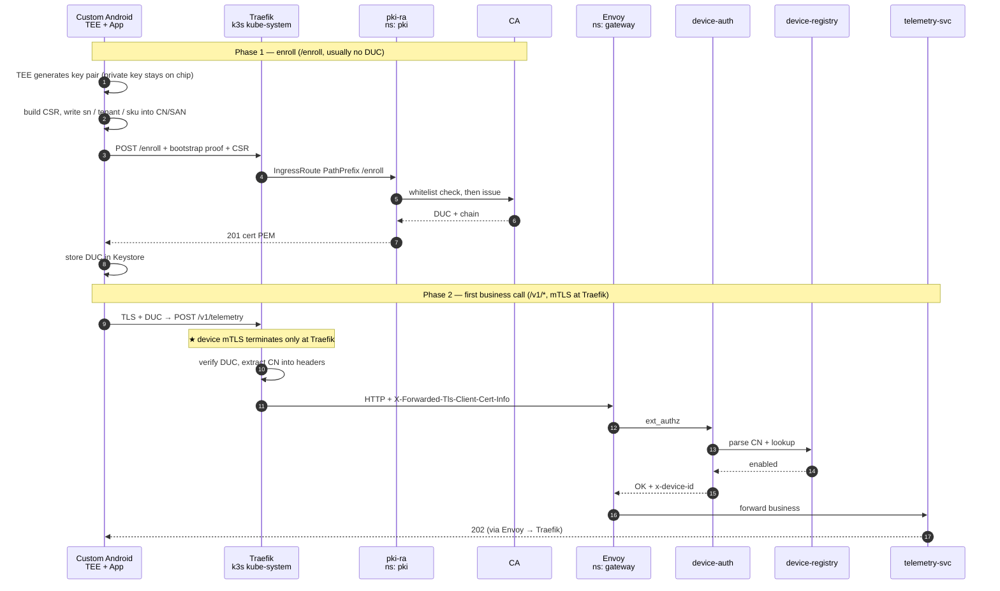
```mermaid
sequenceDiagram
    autonumber
    participant Dev as Custom Android<br/>TEE + App
    participant Tr as Traefik<br/>k3s kube-system
    participant RA as pki-ra<br/>ns: pki
    participant CA as CA
    participant Ey as Envoy<br/>ns: gateway
    participant Auth as device-auth
    participant Reg as device-registry
    participant Tel as telemetry-svc

    Note over Dev,CA: Phase 1 — enroll (/enroll, usually no DUC)
    Dev->>Dev: TEE generates key pair (private key stays on chip)
    Dev->>Dev: build CSR, write sn / tenant / sku into CN/SAN
    Dev->>Tr: POST /enroll + bootstrap proof + CSR
    Tr->>RA: IngressRoute PathPrefix /enroll
    RA->>CA: whitelist check, then issue
    CA-->>RA: DUC + chain
    RA-->>Dev: 201 cert PEM
    Dev->>Dev: store DUC in Keystore

    Note over Dev,Tel: Phase 2 — first business call (/v1/*, mTLS at Traefik)
    Dev->>Tr: TLS + DUC → POST /v1/telemetry
    Note over Tr: ★ device mTLS terminates only at Traefik
    Tr->>Tr: verify DUC, extract CN into headers
    Tr->>Ey: HTTP + X-Forwarded-Tls-Client-Cert-Info
    Ey->>Auth: ext_authz
    Auth->>Reg: parse CN + lookup
    Reg-->>Auth: enabled
    Auth-->>Ey: OK + x-device-id
    Ey->>Tel: forward business
    Tel-->>Dev: 202 (via Envoy → Traefik)
```

Three locations vs components:

1. **CSR**: phase 1, device → Traefik `/enroll` → **pki-ra / CA**.
2. **mTLS**: phase 2, device ↔ **Traefik**. Envoy and microservices are already HTTP.
3. **Parse CN**: Traefik extracts; **device-auth** interprets and looks up the registry. This is after mTLS succeeds.

---

## 8. How the backend parses fields in the CN

Suppose issuance uses:

```text
CN = {tenant}.{env}.{sku}.{deviceId}
e.g. acme.prod.pad.A1B2C3D4
```

Backend logic, conceptually:

```text
1. Read the header Traefik injects: X-Forwarded-Tls-Client-Cert-Info
   Do not read X-Client-CN / X-Client-Verify: Traefik neither writes nor deletes those, so a device can forge them
   NetworkPolicy must block bypassing Ingress to ClusterIP
2. Take CN from the Subject inside Cert-Info (the value is URL-encoded)
3. tenant, env, sku, deviceId = cn.split(".")
4. Device Registry lookup:
     - is this cert serial / fingerprint enrolled?
     - is the device disabled or revoked?
     - is this sku allowed to call this API?
5. On success, deviceId is the request's device principal
```

Safer: **do not put the only identity in CN** (length and charset fight the spec). Prefer:

| Where | Use |
|---|---|
| Cert serial / fingerprint | Primary key, revoke, rotate, audit |
| SAN URI | Structured identity (tenant/sku/sn) |
| CN | Humans and logs |
| Backend Device Registry | Map cert fingerprint → business device record |

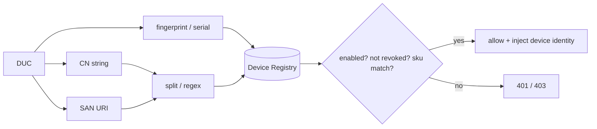
```mermaid
flowchart LR
    CERT[DUC] --> FPR[fingerprint / serial]
    CERT --> CN[CN string]
    CERT --> SAN[SAN URI]

    FPR --> REG[(Device Registry)]
    CN --> PARSE[split / regex]
    SAN --> PARSE
    PARSE --> REG
    REG --> DEC{enabled? not revoked? sku match?}
    DEC -->|yes| OK[allow + inject device identity]
    DEC -->|no| NO[401 / 403]
```

### 8.1 What a fingerprint is, how it is computed, what it is for

A **fingerprint** (sometimes thumbprint) is a hash of **this exact certificate's DER bytes**, usually **SHA-256**. It names **this issued cert file**, not the deviceId sitting in the CN.

```bash
openssl x509 -in dummy-duc.crt -noout -fingerprint -sha256
# sha256 Fingerprint=AB:CD:...
```

That is `SHA256(cert DER)`. Same PEM → same fingerprint every time. Re-issue the cert (even with the same CN) → fingerprint changes.

| Use | Why | Why not just CN |
|---|---|---|
| Device Registry primary key | Bind "this issued DUC ↔ business device" | CN can be re-issued or collide on format; fingerprint pins this cert |
| Revoke / rotate | Mark the old fingerprint invalid; enroll writes a new one | CN often stays the same across rotations |
| Audit logs | Record which cert came in | CN is for humans; fingerprint is for reconciling |
| Optional pinning | Require this exact cert (or this CA) | Stricter than trusting a whole CA; painful on rotation |

**Split of labor with mTLS:**

1. Traefik uses the Device CA as the **trust anchor**: is this DUC signed by us, unexpired, not revoked.  
2. On success, `passTLSClientCert` writes the fields you selected into `X-Forwarded-Tls-Client-Cert-Info` (CN, SAN, serial). **That header has no fingerprint.** For a fingerprint, set `pem: true` and have device-auth SHA-256 the PEM, or match on serial in the Registry.  
3. **device-auth** looks the fingerprint up in the Registry: is this device enabled in the product. TLS success ≠ business allow — a recalled device might still pass TLS before CRL catches up, while Registry already disabled it.

```text
mTLS success        =  this DUC is cryptographically valid
fingerprint hits    =  we accept this cert / this device in the product
```

Do not replace the trust anchor with fingerprints: Traefik will not hold ten thousand device fingerprints as roots. The trust anchor trusts one CA once; the fingerprint is how the business layer claims *this issued cert*.

### 8.2 What form a Device Registry usually takes

It is **not** a k8s Secret and **not** the CA. The CA issues DUCs. The Registry is the **business device dossier**, almost always:

**a Postgres (or MySQL) table plus a device-registry / device-auth service in front.** The hot path often adds Redis: fingerprint → dossier.

Typical tables (names arbitrary):

```text
devices
  device_id          business PK (factory SN / your UUID)
  tenant, sku, env
  status             active | disabled | recalled
  current_fingerprint   SHA-256 of the current DUC
  cert_serial
  enrolled_at, last_seen_at

device_certs          one device, many certs (rotation history)
  fingerprint        PK
  device_id          FK
  not_before, not_after
  status             current | rotated | revoked
```

Forms compared:

| Form | When | What it is not |
|---|---|---|
| **Postgres rows** | Default. You want transactions, audit, tenant queries | Not the cert itself; do not store PEM |
| **Redis** | Every business request does a Redis GET by fingerprint; a hit skips Postgres | Cache only; SQL remains authoritative |
| **IoT platform Thing Registry** | AWS IoT / Azure DPS — same idea, hosted | Self-hosted k3s still usually one SQL table |
| **MDM / factory work-order DB** | First row at enroll (this SN may receive a cert) | May be other tables in the same database |
| **k8s CRD** | Tiny fleets treated as config | Do not store tens of thousands of devices as K8s objects |

Read / write path:

- **enroll**: RA issued a DUC → `INSERT` / update `current_fingerprint`.  
- **every business request**: device-auth looks up the fingerprint Traefik forwarded (Redis GET first; miss then Postgres). This read must be fast, so it often sits behind Envoy `ext_authz`.  
- **recall / disable**: flip `status`; you need not wait for CRL. Traefik may still succeed mTLS; Registry denies.  
- **rotate**: old fingerprint → `rotated`, new one becomes `current`.

The `device-registry` box in the diagrams is that service; the data lives in **SQL behind it**, not in Traefik config, not in the TEE.

---

## 9. What TEE is: where keys actually live on the device

**TEE = Trusted Execution Environment.**  
A small isolated computer beside ordinary Android: its own kernel, memory, key store. A normal app — even with root — cannot read the private key bytes.

Against this auth design:

| Term | What it is | What it does here |
|---|---|---|
| **REE** | Rich Execution Environment: everyday Android — apps, Java/Kotlin, Linux | Build CSR, run TLS, connect to Traefik. **Cannot see the private key.** |
| **TEE** | Secure world carved out of the SoC (usually TrustZone on ARM) | **Generates and holds the device private key**; actually performs CSR signing and mTLS `CertificateVerify` |
| **Android Keystore** | API / front desk in the REE | App only gets an alias (handle): "please sign this". Keystore forwards the op into the TEE |
| **StrongBox** | Harder than TEE: a separate Secure Element, not a CPU partition | Some custom devices store the DUC key here; API is still Keystore, with `setIsStrongBoxBacked(true)` |
| **DUC** | Cert file PKI issued | May live in the REE (certs are public); the matching private key must stay in TEE/StrongBox |

One line: **Keystore is the counter, TEE/StrongBox is the vault, DUC is the photocopy taped on the vault door.**

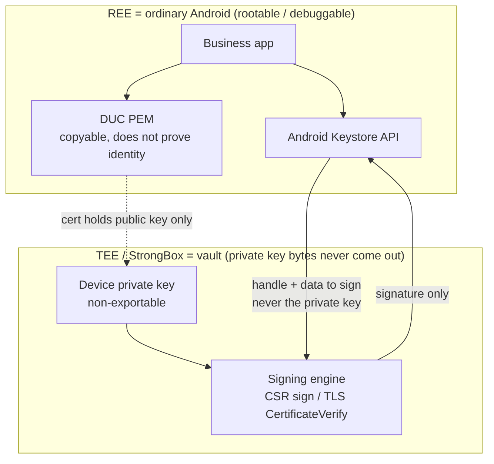
```mermaid
flowchart TB
    subgraph REE["REE = ordinary Android (rootable / debuggable)"]
        APP[Business app]
        AKS[Android Keystore API]
        CERT[DUC PEM<br/>copyable, does not prove identity]
        APP --> AKS
        APP --> CERT
    end

    subgraph TEE["TEE / StrongBox = vault (private key bytes never come out)"]
        PRIV[Device private key<br/>non-exportable]
        SIGN[Signing engine<br/>CSR sign / TLS CertificateVerify]
        PRIV --> SIGN
    end

    AKS -->|"handle + data to sign<br/>never the private key"| SIGN
    SIGN -->|"signature only"| AKS
    CERT -.->|cert holds public key only| PRIV
```

Without a TEE, if the private key is a normal file (`/data/.../client.key`), root, backup, or an image copy clones "this device". With a TEE, an attacker can steal the DUC (public cert) at most; without the vault key they fail Traefik mTLS.

### 9.1 Where it sits on the request path

TEE **does not exist on the k3s side**. It lives only inside Android, and wakes for two jobs:

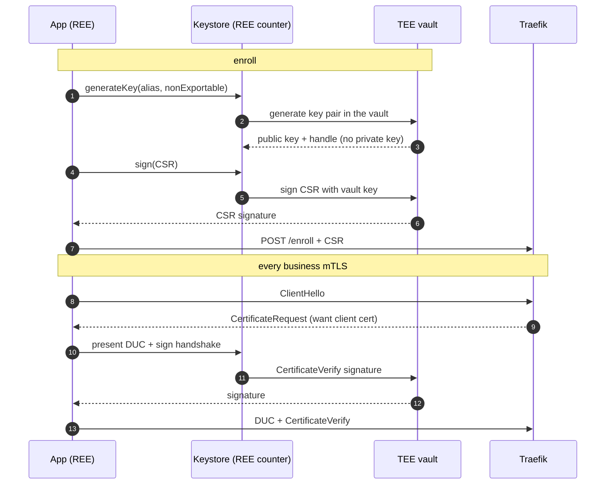
```mermaid
sequenceDiagram
    autonumber
    participant App as App (REE)
    participant KS as Keystore (REE counter)
    participant TEE as TEE vault
    participant Tr as Traefik

    Note over App,TEE: enroll
    App->>KS: generateKey(alias, nonExportable)
    KS->>TEE: generate key pair in the vault
    TEE-->>KS: public key + handle (no private key)
    App->>KS: sign(CSR)
    KS->>TEE: sign CSR with vault key
    TEE-->>App: CSR signature
    App->>Tr: POST /enroll + CSR

    Note over App,Tr: every business mTLS
    App->>Tr: ClientHello
    Tr-->>App: CertificateRequest (want client cert)
    App->>KS: present DUC + sign handshake
    KS->>TEE: CertificateVerify signature
    TEE-->>App: signature
    App->>Tr: DUC + CertificateVerify
```

So "the private key never leaves the device" is more precise as: **the private key never leaves the TEE**. CSR, DUC, HTTP, and Traefik only ever see the public key and signature results.

### 9.2 Mapping onto this PKI

```text
Private key in TEE   =  this machine's pen
CSR                  =  application form signed with that pen
PKI / CA             =  stamp office; looks at the form and public key
DUC                  =  stamped ID card (public)
mTLS                 =  Traefik spot-check: can you sign the handshake with that pen again
```

Traefik checks "does the signature match the public key in this DUC, and did Device CA issue it". It **does not know or need to know** whether the key was born in TEE, StrongBox, or software Keystore.  
If the backend must also believe "this key is really in hardware", that is a separate thing: **Key Attestation** (the TEE signs a "I was generated in hardware" proof, sent with the CSR to the RA). That is an extra; it is not mTLS itself.

### 9.3 How device-side pieces stack

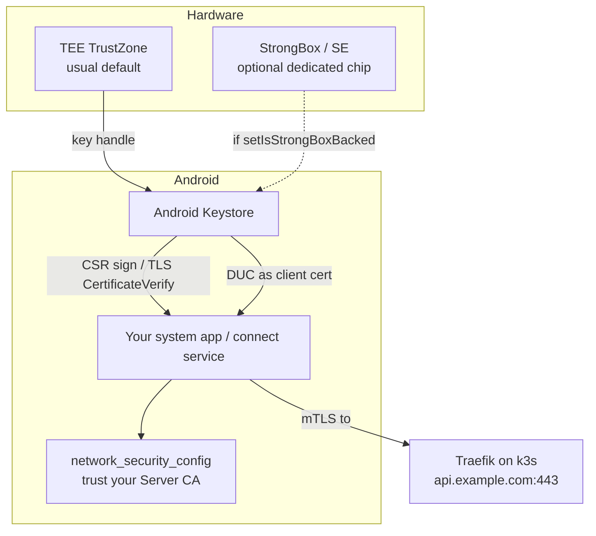
```mermaid
flowchart TB
    subgraph Hardware
        TEE[TEE TrustZone<br/>usual default]
        SB[StrongBox / SE<br/>optional dedicated chip]
    end

    subgraph Android
        AKS[Android Keystore]
        APP[Your system app / connect service]
        NSC[network_security_config<br/>trust your Server CA]
    end

    TEE -->|key handle| AKS
    SB -.->|if setIsStrongBoxBacked| AKS
    AKS -->|CSR sign / TLS CertificateVerify| APP
    AKS -->|DUC as client cert| APP
    APP --> NSC
    APP -->|mTLS to| GW[Traefik on k3s<br/>api.example.com:443]
```

Notes:

- **Private key**: generated in TEE (or StrongBox) at factory or first boot, `non-exportable`. The CSR only takes the public key.
- **DUC**: stamped copy of the public key. You can back up the cert file; you cannot impersonate the device with it alone (no private key).
- **Server trust anchor**: the device must ship / pin your API CA, or it cannot tell the real backend from a fake.
- **Client trust anchor**: Traefik must mount the Device CA that issued DUCs. That is the other half of mTLS.

So mTLS needs **two PKIs**. Do not draw them as one CA:

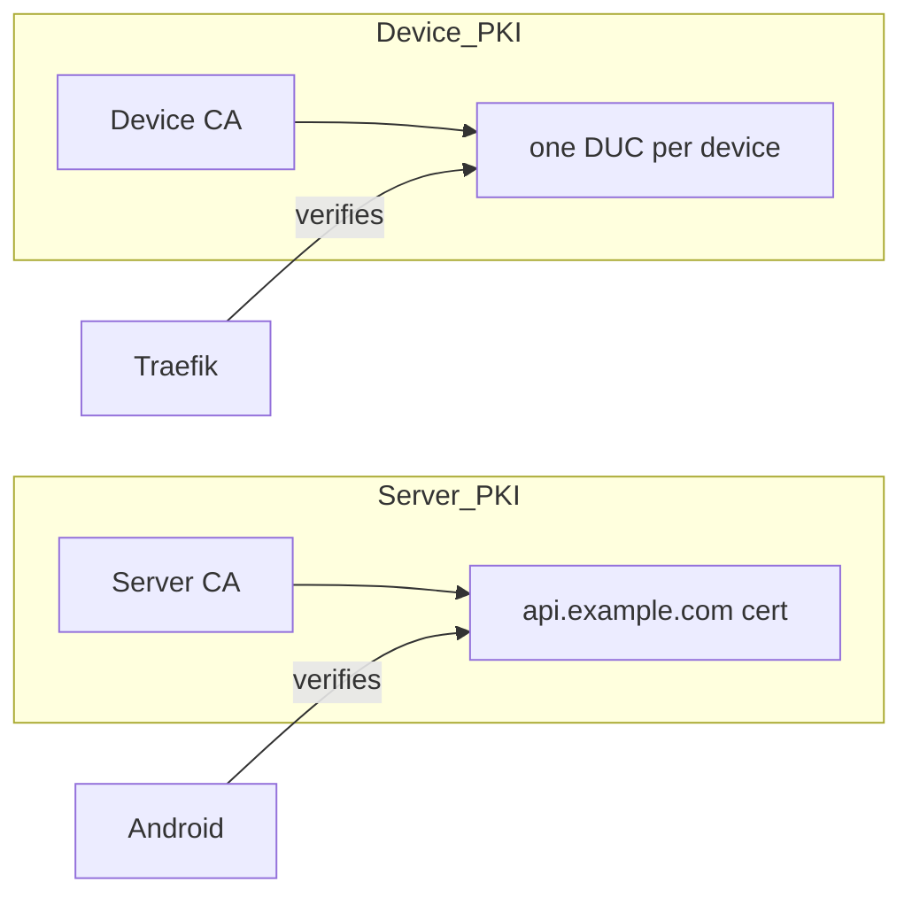
```mermaid
flowchart LR
    subgraph Server_PKI
        SCA[Server CA] --> SCERT[api.example.com cert]
    end

    subgraph Device_PKI
        DCA[Device CA] --> DUC[one DUC per device]
    end

    DEV[Android] -->|verifies| SCERT
    GW[Traefik] -->|verifies| DUC
```

The device uses the Server CA to trust `api.example.com` (often cert-manager issues that cert to Traefik). Traefik uses the Device CA to trust the DUC. That is what mutual means.

### 9.4 What a trust anchor is, where it lives, how it is used

A **trust anchor** is the **CA cert** you already trust when validating a chain (usually a root, sometimes an intermediate). The verifier does not blindly believe the leaf the peer sends. It walks Issuer links until it hits a CA it already has locally — if it never does, the handshake fails.

```text
peer leaf (DUC or api.example.com)
        ↑ signed by
intermediate CA (optional)
        ↑ signed by
Root CA  ←  this pre-installed cert is the trust anchor
```

RFC 5280 path validation, conceptually:

1. Take the leaf + the chain the peer sent.  
2. Check signature, expiry, KU / EKU (`clientAuth` or `serverAuth`).  
3. Walk issuers until the issuer **equals a CA in the local trust store**.  
4. Never get there → fail. A pretty CN does not help.

**This design has two trust anchors, one on each side. Do not swap them.**

| Who holds it | What sits in the trust store | Used to verify | In this repo |
|---|---|---|---|
| Android | **Server CA** (or public roots + pin) | Traefik's `api.example.com` server cert | `pki/server-ca.crt`; on device, `network_security_config` |
| Traefik | **Device CA** | each device DUC | `pki/device-ca.crt`; k3s Secret `device-ca` / Traefik `caFiles` |

Why: Traefik **need not** store ten thousand DUCs. Install Device CA once; every unrevoked DUC it signed passes mTLS. The device **need not** pin Traefik's leaf (leaves rotate); pin/install Server CA.

Versus fingerprint:

```text
trust anchor  =  which CA we trust (one CA → a whole class of certs)
fingerprint   =  which already-issued cert we accept (business primary key)
```

Local `ssl_verify_client on` + `ssl_client_certificate device-ca.pem`: that pem is Traefik's trust anchor. `curl --cacert server-ca.crt` is curl's trust anchor.

---

## 10. How this stacks with user login

A device cert proves **which machine this is**. It usually **does not prove** which end user. Common stack:

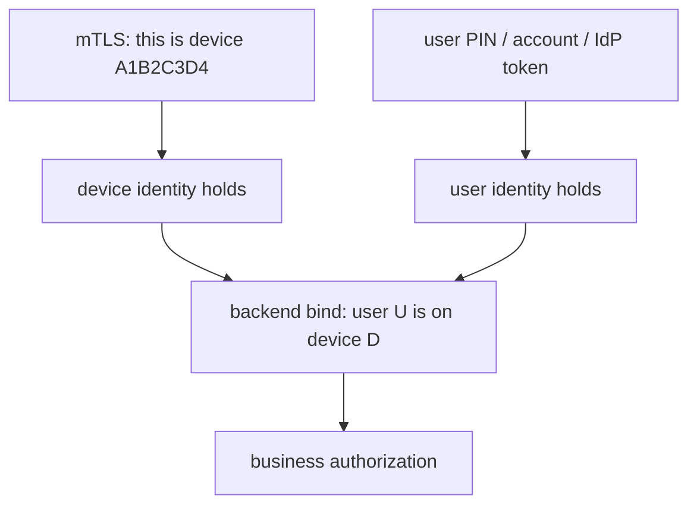
```mermaid
flowchart TB
    MTLS[mTLS: this is device A1B2C3D4] --> DEV_OK[device identity holds]
    USER[user PIN / account / IdP token] --> USER_OK[user identity holds]
    DEV_OK --> BIND[backend bind: user U is on device D]
    USER_OK --> BIND
    BIND --> API[business authorization]
```

Both are common:

1. **Device-only auth**: kiosk / industrial / dedicated terminal. DUC only, no user.
2. **Device + user**: DUC at the door, then OAuth/session inside TLS. A stolen token is useless without that device's private key.

---

## 11. Cheat sheet (so the terms do not blur)

| You hear | Where it actually is | Input | Output |
|---|---|---|---|
| "TEE" | Secure world on the device SoC | Data to sign + key handle | Signature; private key never returned |
| "Keystore" | Android counter API | alias / generation params | Forwards the op into TEE |
| "StrongBox" | Optional dedicated secure chip | Same as Keystore | Harder to break from CPU-side bugs than TEE |
| "Generate a CSR" | App builds the form, TEE signs | Public key + identity fields | CSR file/PEM |
| "Have PKI sign it" | CA in k3s `ns:pki` | CSR + factory/activation proof | DUC + chain |
| "Connect with the DUC" | Android TLS client | DUC + private-key handle | Connect Traefik:443 |
| "k3s" | Cluster, not a hop | Pod / Service / Ingress | Hosts Traefik, Envoy, microservices |
| "mTLS" | **Traefik terminates TLS** | Device DUC + server cert | Handshake success / fail |
| "Traefik" | k3s default Ingress, north-south door | Established mTLS connection | Route by Host/Path, put CN in headers |
| "Envoy" | Optional second hop or sidecar | HTTP + CN headers (edge) or mesh certs (sidecar) | ext_authz / re-route / east-west mTLS |
| "Parse CN" | Traefik extract + **device-auth** split | Subject/SAN headers | deviceId, tenant, sku… |
| "Typical microservice" | Pod behind ClusterIP | Internal identity headers, not the DUC | Business response |
| "auth" | device-auth + registry | Parsed fields + cert fingerprint | Allow / deny / limit |
| "fingerprint" | SHA-256(cert DER) | One issued DUC | Registry key, revoke, rotate, audit |
| "Device Registry" | Postgres table + registry service (Redis on the hot path) | fingerprint ↔ business device | Not the CA, not a k8s Secret, no PEM |
| "trust anchor" | Pre-installed CA cert | Leaf + chain | Handshake against that CA |

---

## 12. Common mix-ups

1. **Treating CN as DNS CNAME**  
   Cert CN is the name on the ID card. DNS CNAME only finds the k3s ServiceLB. device-auth reads the former.

2. **Thinking k3s / telemetry-svc does mTLS**  
   Device mTLS ends at **Traefik**. Microservices only read headers. NetworkPolicy must block bypassing Ingress to ClusterIP, or CN headers are forgeable.

3. **Treating mTLS as "for devices" and TLS as "for browsers"**  
   Both are TLS. The difference is whether the handshake requires a client cert. A browser can do mTLS; a device can use plain HTTPS plus a token.

4. **Treating Envoy sidecar mesh mTLS as the device DUC**  
   Two cert sets. At the door: Device CA signed DUC. Between pods: mesh CA signed SPIFFE identity.

5. **Requiring a client cert at both Traefik and Envoy**  
   After Traefik terminates, downstream is HTTP. Envoy `require_client_certificate` then fails. The second hop eats headers, or you use TLS passthrough (uncommon).

6. **Trusting CN just because the CSR wrote it**  
   The CA must enforce CSR field policy (device on allowlist, tenant matches the work order). Otherwise anyone self-reports `CN=admin`.

7. **Sharing one CA for device and server**  
   Possible, unclear. Prefer a Server CA (for Traefik's `api.example.com`) and a Device CA (for each DUC).

8. **Using a token after the DUC expired**  
   Rotate before expiry: old DUC hits `/enroll` for a new CSR. Rotation uses the same Traefik, different Path.

9. **Treating TEE as a cert or a gateway**  
   TEE is the vault on the device, not the DUC, not Traefik. The k3s cluster never sees it; only Android uses it when signing.

10. **"Export private key" failing in Keystore means generation failed**  
   `non-exportable` is the feature: you can sign, you cannot read. That is what TEE is for.

11. **Treating Device Registry as the CA or as Traefik config**  
    Registry is the business dossier (SQL). The CA issues DUCs; Traefik checks PKI; Registry answers whether this device is enabled in the product.

12. **Assuming Traefik wipes every `X-*` header**  
    It only wipes its managed `X-Forwarded-*` list (including `X-Forwarded-Tls-Client-Cert-Info`). A custom name like `X-Client-CN` is not deleted; a device can forge it. Downstream must read the header Traefik injects, and NetworkPolicy must block hitting ClusterIP directly.

---

## 13. Sentences you should be able to say

1. **CSR** is the form the device takes to the stamp office with its public key; **PKI** is the stamp office (usually a separate `pki` namespace on k3s); **DUC** is the stamped client cert that belongs only to this Android.
2. **k3s is the stage**; request order is `DNS → ServiceLB → Traefik (★ device mTLS) → optional Envoy → device-auth (parse CN) → business microservices`.
3. **Traefik** verifies the DUC and extracts CN; **Envoy** optionally does ext_authz / re-route / east-west mTLS; **typical microservices** do not handshake, they trust internal identity.
4. **The CN the backend parses is a field on the client cert Subject** (optionally SAN). It is trustworthy because Traefik already verified this DUC with the Device CA.
5. **TEE** is the isolated environment on the SoC that holds the private key; **Keystore** is only the counter the app calls. Without that key that cannot leave the vault, the DUC is just a photocopy.
6. **Device Registry** is usually a Postgres device dossier (fingerprint, sn, sku, enabled/recalled) behind a registry service — not the CA, not Traefik.

---

## 14. Local end-to-end mimic: Traefik + dummy DUC + k3s

Yes, the whole chain can run locally. Replace Android/TEE with **openssl-issued file certs**; the rest of the path matches production:

```text
curl --cert dummy-duc.crt --key dummy-duc.key
  → Traefik (verify Device CA, extract CN)
  → whoami / your service
```

You **cannot** fake a DUC with a `.txt` that only contains a CN. Traefik verifies an X.509 client cert: public key, `clientAuth` EKU, signed by the Device CA. A `.txt` is only a memo of what CN this dummy uses.

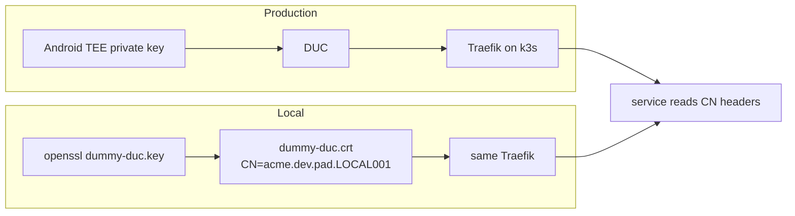
```mermaid
flowchart LR
    subgraph Production
      TEE[Android TEE private key] --> DUC1[DUC]
      DUC1 --> TR1[Traefik on k3s]
    end

    subgraph Local
      FILE[openssl dummy-duc.key] --> DUC2[dummy-duc.crt<br/>CN=acme.dev.pad.LOCAL001]
      DUC2 --> TR2[same Traefik]
    end

    TR1 --> SVC[service reads CN headers]
    TR2 --> SVC
```

Local does **not** mimic TEE (the private key is a file you can copy). You are testing Traefik verification, CN forwarding, and service parsing. That is enough for backend integration.

### 14.1 Where the files live

All under repo `local-mtls-lab/` (sibling of this doc):

```text
local-mtls-lab/
  gen-pki.sh              mint local Device CA + Server CA + dummy DUC
  pki/dummy-cn.txt        memo only: acme.dev.pad.LOCAL001 (Traefik does not read this)
  pki/dummy-duc.crt/.key  ★ dummy DUC actually used by curl
  pki/device-ca.crt       CA Traefik uses to verify the DUC
  pki/server-ca.crt       CA curl uses to verify api.mtls.local
  pki/api.mtls.local.*    Traefik server cert
  docker-compose.yml      Traefik container smoke test without k3s
  traefik/dynamic.yml     Traefik mTLS config for the compose path
  k3d-up.sh               local k3s (k3d) + the same certs
  k8s/resources.yaml      whoami + TLSOption + IngressRoute
  curl-ok.sh / curl-fail.sh
```

`dummy-cn.txt` is **not** read by Traefik. Changing CN requires re-issuing the cert, not editing the txt:

```bash
cd local-mtls-lab
DUMMY_CN=acme.dev.pad.LOCAL002 ./gen-pki.sh
```

Keys are `.gitignore`d. Do not copy `pki/*.key` to another machine; re-run `./gen-pki.sh` there.

### 14.2 Three test depths (shallow to real)

**① Service CN parsing only (not mTLS)**

Skip Traefik, forge headers. Good for the `device-auth` inner loop. Production must block this path to ClusterIP.

```bash
kubectl -n device-platform port-forward svc/whoami 8080:80
curl -s http://127.0.0.1:8080/ \
  -H 'X-Forwarded-Tls-Client-Cert-Info: Subject="CN=acme.dev.pad.LOCAL001"'
```

**② Traefik container + dummy DUC (real handshake, no k3s)**

When the Docker daemon is up and the current user can reach it:

```bash
cd local-mtls-lab
chmod +x *.sh
./gen-pki.sh
docker compose up -d
./curl-ok.sh      # response should contain CN=acme.dev.pad.LOCAL001
./curl-fail.sh    # no client cert, must fail
```

**③ Local k3s (k3d) full chain**

k3d is k3s in Docker. Traefik is still the default k3s Ingress; only Device CA / server certs are the dummy set above.

```bash
cd local-mtls-lab
chmod +x *.sh
./k3d-up.sh       # installs k3d/kubectl to ~/.local/bin if missing
./curl-ok.sh
```

Hop order matches §6, with curl standing in for the device:

```text
curl(dummy DUC)
  → 127.0.0.1:8443 (compose publish or k3d ServiceLB)
  → Traefik        ★ mTLS
  → Service/whoami
```

whoami dumps Traefik's `X-Forwarded-Tls-Client-Cert-Info`, which includes `CN=acme.dev.pad.LOCAL001`. Point your own service at that header (or add Envoy) without touching cert files again.

② and ③ both bind host `8443`. Do not run them at the same time.

### 14.3 What local deliberately skips

| Production | Local dummy |
|---|---|
| TEE non-exportable private key | `dummy-duc.key` is an ordinary file |
| PKI RA reviews CSR | `gen-pki.sh` signs with the CA key directly |
| Real device SNI / trust anchor | `curl --resolve api.mtls.local:8443:127.0.0.1` (already in the scripts) |
| Envoy ext_authz | Skip for now; whoami already proves CN survived Traefik |

Replace `whoami` with your `device-auth` Deployment and point the IngressRoute at it — same chain, real microservice.

### 14.4 Playbook for an agent on another machine

Hand this subsection to an agent on another machine. Goal: reproduce `dummy DUC → Traefik mTLS → service sees CN`. Do not reinvent the architecture. Do not use a txt as the cert.

**Task**

1. Confirm the repo has `local-mtls-lab/` and the scripts listed here. If missing, recreate the same layout (`gen-pki.sh`, `docker-compose.yml`, `traefik/dynamic.yml`, `k3d-up.sh`, `k8s/resources.yaml`, `curl-ok.sh`, `curl-fail.sh`).
2. Issue a **real** dummy DUC (PEM) with openssl. Default CN `acme.dev.pad.LOCAL001`. Do not wire `dummy-cn.txt` into Traefik.
3. Run depth ② first (docker compose Traefik). If Docker works, then depth ③ (k3d / local k3s).
4. Verify with `curl-ok.sh` / `curl-fail.sh`. Paste command output back to the user.

**Prereqs**

- `openssl` (lab used 3.x)
- `docker`, and the current user can reach the daemon (`docker info` succeeds). Do not assume interactive `sudo docker` can type a password.
- Depth ③ also needs image pulls and write access to `~/.local/bin` for k3d/kubectl (`k3d-up.sh` installs them)

**Hard constraints**

- Dummy DUC = `pki/dummy-duc.crt` + `pki/dummy-duc.key`, issued by `pki/device-ca.crt`, EKU=`clientAuth`
- `pki/dummy-cn.txt` is a memo only; changing CN requires `DUMMY_CN=... ./gen-pki.sh`
- Do not copy `pki/*.key` between machines; re-run `./gen-pki.sh` on the new machine
- Do not simulate TEE / Keystore / StrongBox locally
- Do not require a client cert on both Traefik and the downstream service
- Do not merge Device CA and Server CA "for convenience" (the script already splits them)

**Steps (in order; stop and report on failure)**

```bash
# 0. Working directory
cd local-mtls-lab
chmod +x gen-pki.sh curl-ok.sh curl-fail.sh k3d-up.sh

# 1. Mint dummy PKI (re-issue on a new machine even if pki/ has old files)
./gen-pki.sh
openssl x509 -in pki/dummy-duc.crt -noout -subject -ext subjectAltName
# expect subject CN = acme.dev.pad.LOCAL001
# expect SAN URI:urn:device:tenant=acme:env=dev:sku=pad:sn=LOCAL001
cat pki/dummy-cn.txt   # must match CN; this file is not a cert

# 2. Is Docker usable?
docker info >/tmp/docker-info.out 2>/tmp/docker-info.err
```

If `docker info` fails, do not install k3s yet. Diagnose and put it in the report:

| Symptom | What to do |
|---|---|
| `Cannot connect ... ~/.docker/desktop/docker.sock` | Docker Desktop is down: start it, or set `DOCKER_HOST=unix:///var/run/docker.sock` |
| `/var/run/docker.sock` exists but permission denied | User is not in group `docker`; do not loop on sudo passwords. Tell the user to `usermod -aG docker` and re-login, or run `sudo docker compose up -d` themselves |
| daemon inactive | `systemctl is-active docker`; user must start Docker |

Once Docker works:

```bash
# 3. Depth ②: Traefik container, real mTLS, no k3s
docker compose up -d
sleep 2
./curl-ok.sh
./curl-fail.sh
```

`curl-ok.sh` is equivalent to:

```bash
curl -sS --fail \
  --cacert pki/server-ca.crt \
  --cert pki/dummy-duc.crt \
  --key pki/dummy-duc.key \
  --resolve api.mtls.local:8443:127.0.0.1 \
  https://api.mtls.local:8443/v1/whoami
```

Success: HTTP 200, whoami dump, `X-Forwarded-Tls-Client-Cert-Info` contains `CN=acme.dev.pad.LOCAL001`.  
Failure: handshake error or non-200. Check `docker compose logs traefik`.

`curl-fail.sh` sends no client cert. Success criterion: TLS failure or 4xx, **not** 200.

After depth ② passes, if the user also wants k3s:

```bash
# 4. Depth ③: tear down compose first so it does not steal 8443
docker compose down
./k3d-up.sh
./curl-ok.sh
./curl-fail.sh
```

`k3d-up.sh` will: install k3d/kubectl if missing → `k3d cluster create mtls-lab -p 8443:443@loadbalancer` → push `device-ca` / `api-tls` into `device-platform` → apply `k8s/resources.yaml` (rewrites the CRD group to `traefik.containo.us` if the cluster is on the old API).

**Shortcuts not to take**

- Do not `echo CN > dummy-duc.crt`
- Do not skip `--cert/--key` and claim "mTLS was tested" after only adding HTTP headers (that is depth ①; label it as not mTLS)
- Do not commit dummy private keys to git

**Report template (agent must return this)**

```text
machine: <hostname / OS>
openssl: <version>
docker info: ok | fail (reason)
gen-pki: CN=<...> SAN=<...>
depth ② compose: skipped | curl-ok=<pass/fail+excerpt> curl-fail=<should fail, actual...>
depth ③ k3d: skipped | curl-ok=... curl-fail=...
CN header in whoami: <paste that line>
blocker: <none | Docker perms | image pull | Traefik CRD | ...>
user action needed: <none | start Docker | usermod -aG docker | ...>
```

**Short prompt you can paste to an agent on another machine**

> Read `android-device-pki-mtls.en.md` §14 (especially 14.4). In `local-mtls-lab/` follow the playbook: run `./gen-pki.sh`, then docker compose Traefik + dummy DUC, verify with `curl-ok.sh` / `curl-fail.sh` that whoami shows `CN=acme.dev.pad.LOCAL001`. If Docker works, run `./k3d-up.sh`. Do not use `dummy-cn.txt` as a certificate. Return results using the 14.4 report template.
