# Custom Android 设备：CSR / PKI / DUC / mTLS / CN 字段

> 目标：看清 **custom Android 设备连后台做 auth** 时，CSR / PKI / DUC / TEE 各自干什么；以及请求打进 **k3s** 之后，**Traefik、Envoy、典型微服务** 谁坐在哪一跳、什么顺序碰到证书 CN。术语一律用英文（TEE、vault、Keystore、CSR、mTLS、public key、private key），中文只解释。

English version: [`android-device-pki-mtls.en.md`](./android-device-pki-mtls.en.md)

---

## 0. 先用一句话串起来

```
设备在 TEE（on-chip vault）生成 private key  →  用 public key 填一张 CSR
        ↓
PKI / CA 签发  →  发回这台机器专属的 DUC
        ↓
以后每次连后台，TLS 握手时双方出示证书  =  mTLS（通常在 Traefik 终止）
        ↓
Traefik 抽 CN 头 →（可选 Envoy ext_authz）→ device-auth 解析字段 → 业务微服务
```

**private key 永远不出 TEE。后台永远看不到 private key。后台看到的是已经过 Device CA 校验的证书 CN / SAN。**

**目录**

0. [一句话串起来](#0-先用一句话串起来)
1. [CSR / PKI / DUC](#1-三个词分别是什么)
2. [CN ≠ DNS CNAME](#2-证书上印了什么cn--dns-cname)
3. [领证 vs 亮证](#3-两段生命周期先领证再亮证)
4. [mTLS 在哪一层](#4-mtls-卡在哪一层先看层下一节再落到具体组件)
5. [k3s / Traefik / Envoy / 微服务坐哪](#5-典型架构k3s-上各组件坐在哪)
6. [一次请求的 hop 顺序](#6-一次业务请求的真实顺序hop-by-hop)
7. [出厂到第一次 API](#7-端到端时序从出厂到第一次业务-api落到-k3s-组件)
8. [后台怎么解析 CN](#8-后台怎么解析-cn-里的字段)
9. [TEE / Keystore / StrongBox](#9-tee-是什么设备上 key 实际住哪)
10. [和用户登录怎么叠](#10-和用户登录怎么叠)
11. [对照表](#11-最小对照表怕以后再混)
12. [常见误解](#12-常见误解)
13. [读完后能回答的几句话](#13-读完后你应该能回答的几句话)
14. [本地端到端怎么 mimic](#14-本地端到端怎么-mimictraefik--dummy-duc--k3s)

---

## 1. 三个词分别是什么

| 词 | 全称（本场景） | 它是什么 | 它不是什么 |
|---|---|---|---|
| **CSR** | Certificate Signing Request | 设备生成的签发请求：public key + 想写入证书的身份字段，用 private key 做 signature，证明「我拥有这把 private key」。 | 不是登录凭证。CA 签发之前，CSR 不能拿去连生产后台。 |
| **PKI** | Public Key Infrastructure | 签发/吊销/校验证书的整套体系：Root CA、中间 CA、签发策略、CRL/OCSP、证书模板。 | 不是某一次 HTTPS。也不是 Android 自己。PKI 就是 CA 那一层。 |
| **DUC** | Device Unique Certificate | PKI 签完之后，**这台设备自己那一张 client cert**。运行时 mTLS 出示的就是它。 | 不是 private key。不是用户账号。不是 server cert。 |
| **TEE** | Trusted Execution Environment | 芯片里和普通 Android 隔离的 **vault**：private key 在这里生成、并在这里 sign，字节出不去。详细见 [第 9 节](#9-tee-是什么设备上 key 实际住哪)。 | 不是证书，不是 gateway，也不是 Keystore。k3s / Traefik 完全看不见它。 |

> DUC 在不同公司可能写成 Device Unique Credential / Device Unique Cert。意思一样：**每台机器一张、绑死这台机器 public key 的 client cert**。 
> **Keystore = API，TEE / StrongBox = vault，DUC = 公开的 client cert（只有 public key）。**

三个东西的关系：

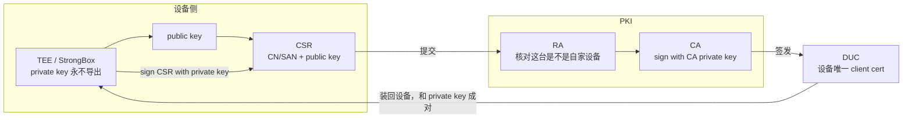
```mermaid
flowchart LR
    subgraph 设备侧
        K[TEE / StrongBox<br/>private key 永不导出]
        PUB[public key]
        CSR[CSR<br/>CN/SAN + public key]
        K --> PUB --> CSR
        K -->|sign CSR with private key| CSR
    end

    subgraph PKI
        RA[RA<br/>核对这台是不是自家设备]
        CA[CA<br/>sign with CA private key]
        RA --> CA
    end

    DUC[DUC<br/>设备唯一 client cert]

    CSR -->|提交| RA
    CA -->|签发| DUC
    DUC -->|装回设备，和 private key 成对| K
```

---

## 2. 证书上印了什么：CN ≠ DNS CNAME

后台说的「解析 cname 里的字段」，在这条链路上 **99% 是证书 Subject 的 CN（Common Name）**，偶尔加上 SAN。 
它 **不是** DNS 里的 CNAME 记录（`foo.example.com CNAME bar.cdn.net`）。

两套完全不同的东西：

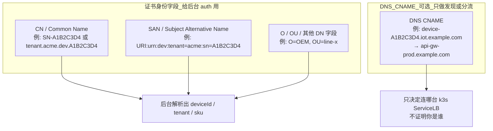
```mermaid
flowchart TB
    subgraph 证书身份字段_给后台 auth 用
        CN["CN / Common Name<br/>例: SN-A1B2C3D4 或 tenant.acme.dev.A1B2C3D4"]
        SAN["SAN / Subject Alternative Name<br/>例: URI:urn:dev:tenant=acme:sn=A1B2C3D4"]
        O["O / OU / 其他 DN 字段<br/>例: O=OEM, OU=line-x"]
    end

    subgraph DNS_CNAME_可选_只做发现或分流
        DNS["DNS CNAME<br/>例: device-A1B2C3D4.iot.example.com<br/>→ api-gw-prod.example.com"]
    end

    CN --> AUTH[后台解析出 deviceId / tenant / sku]
    SAN --> AUTH
    O --> AUTH
    DNS --> ROUTE[只决定连哪台 k3s ServiceLB<br/>不证明你是谁]
```

### 2.1 字段通常怎么编码

签发 CSR 时，设备（或工厂工具）把身份写进 Subject / SAN。常见三种：

```text
# 方案 A：CN 里塞设备序列号
CN=SN-A1B2C3D4, OU=custom-pad, O=YourOEM

# 方案 B：CN 用点分层，后台 split
CN=acme.prod.pad.A1B2C3D4
     │    │    │    └── deviceId
     │    │    └── 产品线
     │    └── 环境
     └── 租户

# 方案 C：CN 只做人读，真正身份放 SAN（更规范）
CN=CustomPad-A1B2C3D4
SAN URI = urn:device:tenant=acme:env=prod:sku=pad:sn=A1B2C3D4
SAN DNS = A1B2C3D4.devices.internal
```

后台解析的就是这些字符串。**能信它们，是因为 mTLS 已经证明：这张证是自家 CA 签的，且对端拥有对应 private key。** 
没有 mTLS，CN 只是一段谁都能伪造的文本。

---

## 3. 两段生命周期：先领证，再亮证

custom Android 设备连后台，其实是 **两条时间线**，不要混在一次 HTTP 调用里想。

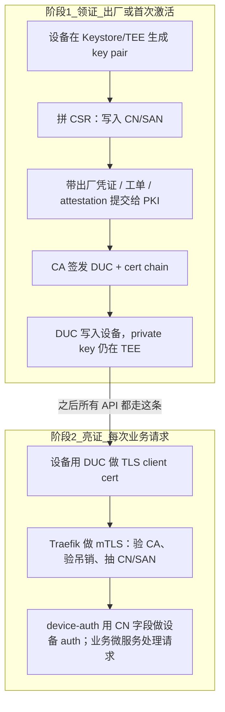
```mermaid
flowchart TB
    subgraph 阶段1_领证_出厂或首次激活
        A1[设备在 Keystore/TEE 生成 key pair]
        A2[拼 CSR：写入 CN/SAN]
        A3[带出厂凭证 / 工单 / attestation 提交给 PKI]
        A4[CA 签发 DUC + cert chain]
        A5[DUC 写入设备，private key 仍在 TEE]
        A1 --> A2 --> A3 --> A4 --> A5
    end

    subgraph 阶段2_亮证_每次业务请求
        B1[设备用 DUC 做 TLS client cert]
        B2[Traefik 做 mTLS：验 CA、验吊销、抽 CN/SAN]
        B3[device-auth 用 CN 字段做设备 auth；业务微服务处理请求]
        B1 --> B2 --> B3
    end

    A5 -->|之后所有 API 都走这条| B1
```

- 阶段 1 可以走工厂工装、激活码、EST/SCEP、自建 `/enroll`。 
- 阶段 2 才是「设备连后台」。mTLS 只出现在阶段 2 的 **TLS 握手**，不在 JSON body 里。

---

## 4. mTLS 卡在哪一层（先看层，下一节再落到具体组件）

### 4.0 TLS vs mTLS：不是「设备 vs 浏览器」

**mTLS 不是另一种协议，也不是「给 device 用的 TLS」。**  
mTLS = **mutual TLS** = 同一次 TLS handshake 里 **两边都出示证书**。  
你平时说的 HTTPS / TLS，默认是 **单向**：只有 server 出示 server cert，client 在 TLS 层是匿名的。

| | 普通 TLS（常见 HTTPS） | mTLS |
|---|---|---|
| handshake 谁出示 cert | **只有 server**（`api.example.com`） | **server + client** 都出示 |
| client 在 TLS 层是谁 | 匿名。身份靠后面的 cookie / password / OAuth | 已经是一张 client cert（这里就是 DUC） |
| 谁都能用 | 浏览器、App、device、curl 都可以 | 浏览器、App、device、curl 也都可以，只要有 client cert |
| 本方案里 | 浏览器打开运营后台，通常就是这种 | custom Android 连 Traefik，用 DUC 做 client cert |

所以：

- 浏览器也可以做 mTLS（公司内网、银行 U 盾、Chrome 选 client cert 那套）。
- device 也可以只用普通 TLS + token，完全不碰 mTLS。
- 差别只在：**TLS 层有没有强制 client cert**，不在 client 是手机还是 Chrome。

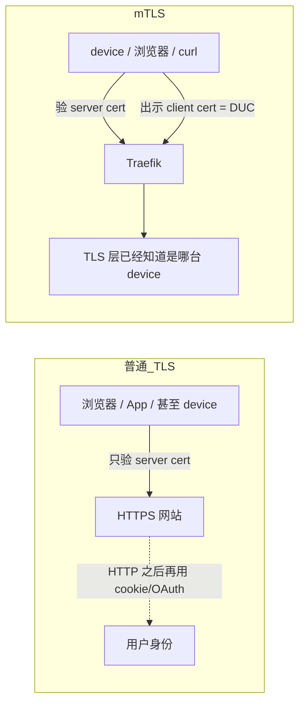
```mermaid
flowchart LR
    subgraph 普通_TLS
        B[浏览器 / App / 甚至 device] -->|"只验 server cert"| S1[HTTPS 网站]
        S1 -.->|HTTP 之后再用 cookie/OAuth| U[用户身份]
    end

    subgraph mTLS
        D[device / 浏览器 / curl] -->|"验 server cert"| S2[Traefik]
        D -->|"出示 client cert = DUC"| S2
        S2 --> ID[TLS 层已经知道是哪台 device]
    end
```

本方案选 mTLS，是因为每台 custom Android 都有 TEE 里的 private key + DUC，适合在握手时证明「这是哪台机器」。运营人员用浏览器登录后台，一般 **不必** 走同一套 DUC。

mTLS = **Mutual TLS**：握手时 **双方都要出示证书**。

| 方向 | 谁出示 | 证书类型 | 对方验什么 |
|---|---|---|---|
| 服务器 → 设备 | Traefik 上的 `api.example.com` 证书 | server cert | 设备验：是不是 `api.example.com`，链是否信任 |
| 设备 → 服务器 | **DUC** | client cert | **Traefik** 验：是不是你们 CA 签的、有没有吊销、EKU 是否允许 clientAuth |

它发生在 **HTTP 之前**。k3s 里默认由 **Traefik** 做这一跳；业务 Pod 摸不到原始握手，只能吃转发过来的头。

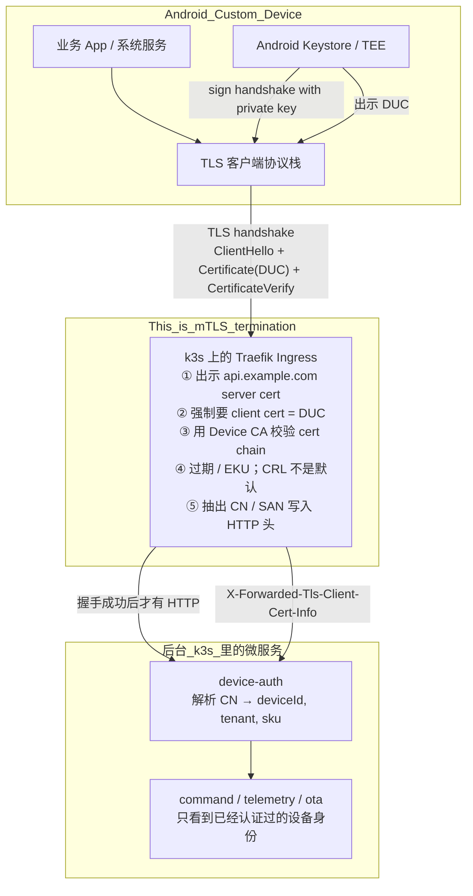
```mermaid
flowchart TB
    subgraph Android_Custom_Device
        APP[业务 App / 系统服务]
        KS[Android Keystore / TEE]
        TLS_C[TLS 客户端协议栈]
        APP --> TLS_C
        KS -->|sign handshake with private key| TLS_C
        KS -->|出示 DUC| TLS_C
    end

    subgraph This_is_mTLS_termination
        LB["k3s 上的 Traefik Ingress<br/>① 出示 api.example.com server cert<br/>② 强制要 client cert = DUC<br/>③ 用 Device CA 校验 cert chain<br/>④ 过期 / EKU；CRL 不是默认<br/>⑤ 抽出 CN / SAN 写入 HTTP 头"]
    end

    subgraph 后台_k3s_里的微服务
        AUTH[device-auth<br/>解析 CN → deviceId, tenant, sku]
        BIZ[command / telemetry / ota<br/>只看到已经认证过的设备身份]
    end

    TLS_C -->|"TLS handshake<br/>ClientHello + Certificate(DUC) + CertificateVerify"| LB
    LB -->|握手成功后才有 HTTP| AUTH
    LB -->|"X-Forwarded-Tls-Client-Cert-Info"| AUTH
    AUTH --> BIZ
```

图里如果还出现 `X-Client-CN`，那是简称。Traefik 写入、并且会先删掉客户端伪造值的头，是 `X-Forwarded-Tls-Client-Cert-Info`。device-auth 读这个，不要读 `X-Client-CN`（Traefik 不写、也不删）。

### 4.1 分层对照（从底到顶）

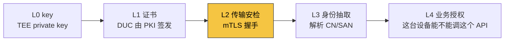
```mermaid
flowchart LR
    L0[L0 key<br/>TEE private key] --> L1[L1 证书<br/>DUC 由 PKI 签发]
    L1 --> L2[L2 传输安检<br/>mTLS 握手]
    L2 --> L3[L3 身份抽取<br/>解析 CN/SAN]
    L3 --> L4[L4 业务授权<br/>这台设备能不能调这个 API]

    style L2 fill:#f5c542,stroke:#333,color:#000
```

黄色那一层才是 mTLS。 
CSR / PKI 在 L1 之前就结束了。 
「解析 CN 字段」是 L3。 
用户登录、token、业务权限是 L4，可以和设备证书叠加，但不能替代 mTLS。

### 4.2 终止 TLS 的位置：nginx 对照，k3s 上就是 Traefik

mTLS 发生在集群门口，不是 Spring/Django 里。左边是 nginx 里你会找的指令；右边是 k3s 默认 Ingress（Traefik）的同一件事。头的名字两边不一样。

| nginx | k3s / Traefik | 干什么 |
|---|---|---|
| `ssl_client_certificate` | Secret `device-ca`，key 必须是 `ca.crt` | 装 Device CA |
| `ssl_verify_client on` | `TLSOption` `RequireAndVerifyClientCert` | 没有合法 DUC 就没有 HTTP |
| `proxy_set_header X-SSL-Client-CN` | `passTLSClientCert` → `X-Forwarded-Tls-Client-Cert-Info` | 把 CN 交给下游 |

nginx 只用来对照，这套设计不跑 nginx：

```nginx
ssl_verify_client on;
ssl_client_certificate /etc/pki/device-ca-chain.pem;
proxy_set_header X-SSL-Client-CN $ssl_client_s_dn_cn;
```

k3s 上三个对象（完整字段在 [§6.2.1](#621-traefik-要配哪把-ca写在哪)）：

```yaml
# 1. Device CA。不用改 Traefik 启动参数，也不用 mount 进 Traefik Pod
# kubectl -n device-platform create secret generic device-ca --from-file=ca.crt=pki/device-ca.crt
---
apiVersion: traefik.io/v1alpha1
kind: TLSOption
metadata:
  name: mtls
  namespace: device-platform
spec:
  clientAuth:
    secretNames: [device-ca]
    clientAuthType: RequireAndVerifyClientCert
---
apiVersion: traefik.io/v1alpha1
kind: Middleware
metadata:
  name: pass-client-cert
  namespace: device-platform
spec:
  passTLSClientCert:
    pem: false
    info:
      sans: true
      subject:
        commonName: true
---
# 2. 挂在业务 IngressRoute 上。/enroll 不要挂这个 TLSOption
# spec.tls.secretName: api-tls          ← Traefik 自己的 server cert
# spec.tls.options.name: mtls
# spec.routes[].middlewares: pass-client-cert
```

下游读 `X-Forwarded-Tls-Client-Cert-Info` 里的 CN，再 `split('.')`。不要读 nginx 那几个 `X-SSL-Client-*`：Traefik 不写它们。

下一节把这个「网关」拆成 k3s 上真实会碰到的组件：Traefik、Envoy、Service、典型微服务。

---

## 5. 典型架构：k3s 上各组件坐在哪

把后台想成一台机器会迷路。真实部署几乎总是：

- **k3s** = 集群操作系统。它 **不是** 请求路径上的一跳，而是 Traefik / Envoy / 微服务 **跑在里面的地方**。
- **Traefik** = k3s 默认 Ingress Controller。设备从公网进来后，**第一个能做 mTLS 的 L7 组件通常是它**。
- **Envoy** = 更通用的 L7 代理。可以当第二道 API Gateway，也可以当每个微服务旁边的 sidecar（东西向 mTLS ）。它 **默认不随 k3s 安装**，要自己加。
- **典型微服务** = ClusterIP 后面的 Pod。它们几乎不直接跟 Android 做握手，只消费 Traefik/Envoy 转过来的头。

### 5.1 先分清南北向 vs 东西向

设备 DUC 只出现在 **南北向**（设备 → 集群门口）。 
集群内部服务与服务之间如果也做 mTLS，那是 **另一套证书**（mesh / SPIFFE），不是设备那张 DUC。

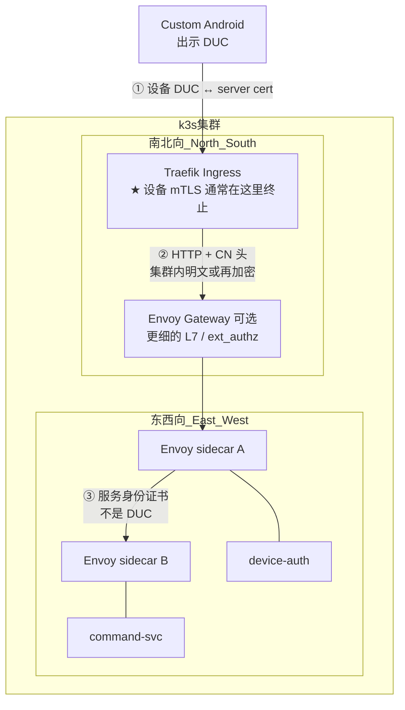
```mermaid
flowchart TB
    DEV[Custom Android<br/>出示 DUC]

    subgraph k3s集群
        subgraph 南北向_North_South
            TRAEFIK["Traefik Ingress<br/>★ 设备 mTLS 通常在这里终止"]
            ENVOY_GW["Envoy Gateway 可选<br/>更细的 L7 / ext_authz"]
        end

        subgraph 东西向_East_West
            SIDECAR_A[Envoy sidecar A]
            SIDECAR_B[Envoy sidecar B]
            MS_A[device-auth]
            MS_B[command-svc]
            SIDECAR_A --- MS_A
            SIDECAR_B --- MS_B
        end
    end

    DEV -->|"① 设备 DUC ↔ server cert"| TRAEFIK
    TRAEFIK -->|② HTTP + CN 头<br/>集群内明文或再加密| ENVOY_GW
    ENVOY_GW --> SIDECAR_A
    SIDECAR_A -->|"③ 服务身份证书<br/>不是 DUC"| SIDECAR_B
```

读图口诀：**DUC 在 edge（Traefik）交掉；cluster 里面跑的是另一套身份。**

### 5.2 k3s 里各组件的位置（一张总图）

下面是这个场景里最典型的落位。k3s 自带左边基础设施；右边业务你自己部署。

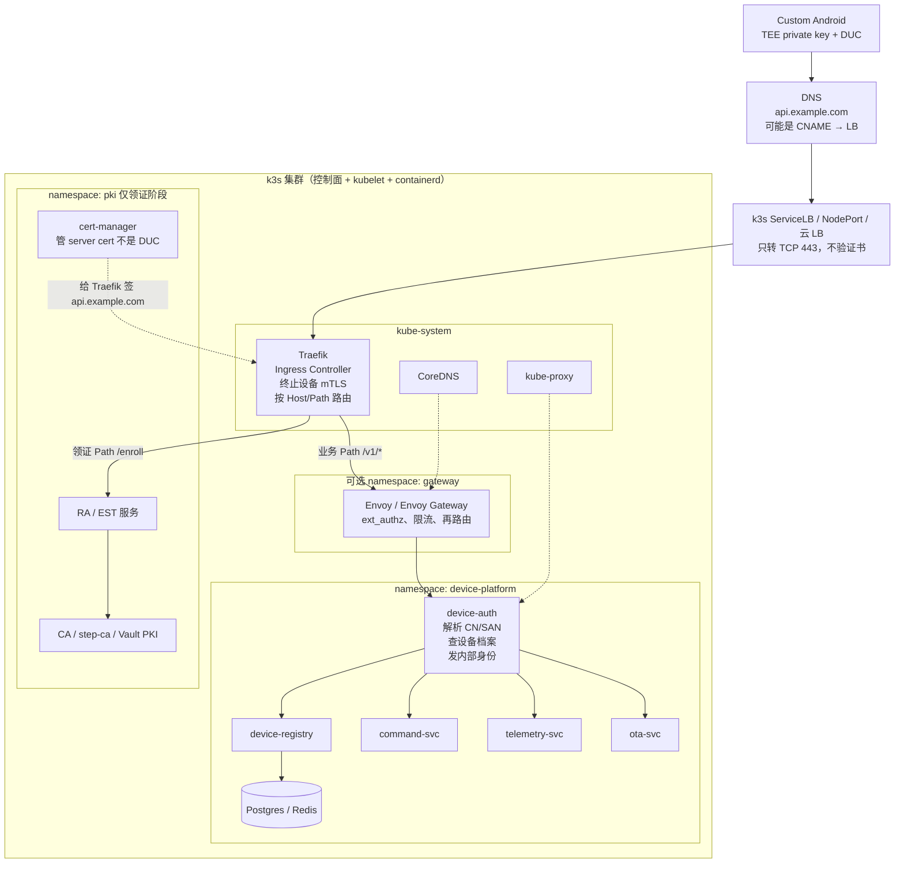
```mermaid
flowchart TB
    DEV[Custom Android<br/>TEE private key + DUC]

    DNS["DNS<br/>api.example.com<br/>可能是 CNAME → LB"]
    LB["k3s ServiceLB / NodePort / 云 LB<br/>只转 TCP 443，不验证书"]

    subgraph k3s["k3s 集群（控制面 + kubelet + containerd）"]
        subgraph kube_system["kube-system"]
            TRAEFIK["Traefik<br/>Ingress Controller<br/>终止设备 mTLS<br/>按 Host/Path 路由"]
            COREDNS[CoreDNS]
            KP[kube-proxy]
        end

        subgraph ns_edge["可选 namespace: gateway"]
            ENVOY["Envoy / Envoy Gateway<br/>ext_authz、限流、再路由"]
        end

        subgraph ns_app["namespace: device-platform"]
            AUTH["device-auth<br/>解析 CN/SAN<br/>查设备档案<br/>发内部身份"]
            REG["device-registry"]
            CMD["command-svc"]
            TEL["telemetry-svc"]
            OTA["ota-svc"]
            DB[(Postgres / Redis)]
        end

        subgraph ns_pki["namespace: pki 仅领证阶段"]
            RA[RA / EST 服务]
            CA[CA / step-ca / Vault PKI]
            CM[cert-manager<br/>管 server cert 不是 DUC]
        end
    end

    DEV --> DNS --> LB --> TRAEFIK
    TRAEFIK -->|"业务 Path /v1/*"| ENVOY
    TRAEFIK -->|"领证 Path /enroll"| RA
    ENVOY --> AUTH
    AUTH --> REG
    AUTH --> CMD
    AUTH --> TEL
    AUTH --> OTA
    REG --> DB
    RA --> CA
    CM -.->|给 Traefik 签 api.example.com| TRAEFIK
    COREDNS -.-> ENVOY
    KP -.-> AUTH
```

谁干什么、**不**干什么：

| 组件 | 在请求路径上的角色 | 碰不碰设备 DUC | 典型安装位置 |
|---|---|---|---|
| **k3s** | 调度 Pod、提供 Service/DNS/证书 Secret 挂载 | 不直接碰 | 整台节点上的 `k3s` 进程 |
| **ServiceLB / NodePort** | 把 `节点IP:443` 转到 Traefik | 不验证书，只转 TCP | k3s 自带 klipper-lb，或外接 LB |
| **Traefik** | **南北向 TLS 终止 + Ingress 路由**。验 DUC、抽 CN、按 Host/Path 分发 | **验 DUC 的主位置** | `kube-system` Deployment/DaemonSet，k3s 默认就有 |
| **Envoy** | 可选第二跳：`ext_authz` 调 device-auth、精细路由、或 sidecar 做东西向 mTLS | 边缘 Envoy 可以再读 Traefik 传来的头；sidecar **不**拿 DUC | 需自建：Envoy Gateway / Contour / Istio |
| **CoreDNS** | 集群内 `device-auth.device-platform.svc` 解析 | 否 | k3s 自带 |
| **kube-proxy** | ClusterIP → Endpoints/Pod | 否 | k3s 自带 |
| **device-auth** | 信 Traefik/Envoy 传来的头，parse CN，查 registry，产出内部身份 | 只读头，不握手 | 业务 namespace |
| **device-registry / command / telemetry** | 典型微服务。只认内部身份 | 否 | 业务 namespace |
| **PKI RA/CA** | 只在领证/轮证时出场，签发 DUC | 签发 DUC，不在每次业务请求上 | 独立 namespace，务必和业务隔离 |
| **cert-manager** | 给 `api.example.com` 签 **server cert** | 不管设备 DUC | 常和 Traefik 搭配 |

### 5.2.1 落到 k3s 节点上长什么样

逻辑图容易让人以为 Traefik 是集群外面的盒子。物理上它就是集群里的一组 Pod：

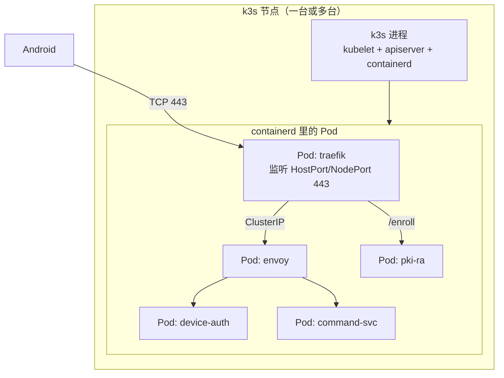
```mermaid
flowchart TB
    subgraph Node["k3s 节点（一台或多台）"]
        K3S[k3s 进程<br/>kubelet + apiserver + containerd]

        subgraph Pods["containerd 里的 Pod"]
            T[Pod: traefik<br/>监听 HostPort/NodePort 443]
            E[Pod: envoy]
            A[Pod: device-auth]
            C[Pod: command-svc]
            P[Pod: pki-ra]
        end

        K3S --> Pods
    end

    DEV[Android] -->|TCP 443| T
    T -->|ClusterIP| E
    E --> A
    E --> C
    T -->|/enroll| P
```

请求不会「经过 k3s」这个进程做 L7。k3s 只负责把这些 Pod 调度起来、把 Service 的 iptables/ipvs 配好。真正处理字节的是 Traefik / Envoy / 微服务容器。

### 5.3 Traefik 和 Envoy 怎么分工（两种典型拼法）

k3s 开箱是 Traefik。Envoy 不是必须的。按复杂度选一种即可。

**拼法 A — 最小典型（最常见）：只在 Traefik 做设备 mTLS**

```text
Android --mTLS--> Traefik --HTTP+CN头--> device-auth --> 其它微服务
```

适合：设备量不大、路由规则简单、团队已经在用 k3s Ingress。

**拼法 B — 生产常见：Traefik 管门，Envoy 管鉴权编排**

```text
Android --mTLS--> Traefik --HTTP+证书信息头--> Envoy
 └─ ext_authz --> device-auth
 └─ 通过后转发 --> command / telemetry ...
```

适合：要把「验证书」和「这台设备能不能调这个 API」拆开；限流、灰度、按 sku 路由放在 Envoy。

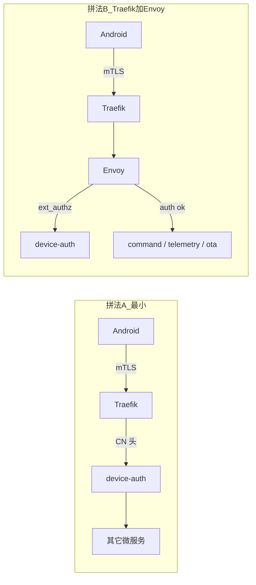
```mermaid
flowchart LR
    subgraph 拼法A_最小
        A1[Android] -->|mTLS| A2[Traefik] -->|CN 头| A3[device-auth] --> A4[其它微服务]
    end

    subgraph 拼法B_Traefik加Envoy
        B1[Android] -->|mTLS| B2[Traefik] --> B3[Envoy]
        B3 -->|ext_authz| B4[device-auth]
        B3 -->|auth ok| B5[command / telemetry / ota]
    end
```

不要两处都 `require_client_certificate`。证书在 Traefik 终止后，后面是 HTTP，Envoy 再也看不到 DUC 原文，只能看到 Traefik 放进头里的 CN/SAN。这是预期行为。

### 5.4 典型微服务怎么切

设备后台很少是一个单体。一组最小够用的服务：

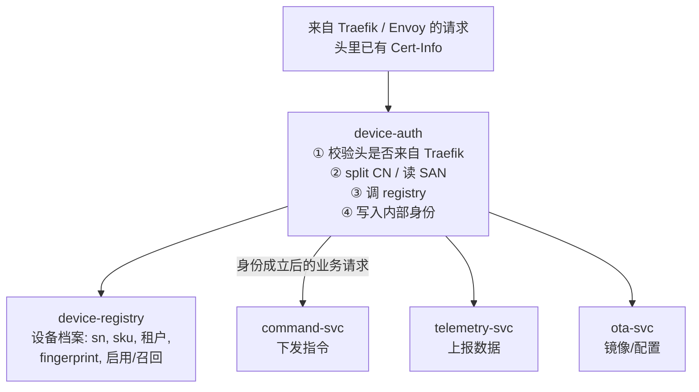
```mermaid
flowchart TB
    IN[来自 Traefik / Envoy 的请求<br/>头里已有 Cert-Info]

    AUTH[device-auth<br/>① 校验头是否来自 Traefik<br/>② split CN / 读 SAN<br/>③ 调 registry<br/>④ 写入内部身份]

    REG[device-registry<br/>设备档案: sn, sku, 租户,<br/>fingerprint, 启用/召回]

    CMD[command-svc<br/>下发指令]
    TEL[telemetry-svc<br/>上报数据]
    OTA[ota-svc<br/>镜像/配置]

    IN --> AUTH
    AUTH --> REG
    AUTH -->|身份成立后的业务请求| CMD
    AUTH --> TEL
    AUTH --> OTA
```

| 服务 | 同步还是异步 | 和证书的关系 |
|---|---|---|
| device-auth | 每个请求同步 | **唯一应该解析 CN 的服务**（或 Envoy ext_authz 调它） |
| device-registry | auth 同步读；开通/吊销异步写 | **Postgres 设备档案**：fingerprint ↔ 业务设备 ID（热路径可 Redis） |
| command / telemetry / ota | 业务 | 只认 auth 签发的内部身份，不要自己再 parse CN |

原则：**解析 CN 只发生一次**，其余服务不要每人拆一遍字符串。

---

## 6. 一次业务请求的真实顺序（hop-by-hop）

以拼法 B、设备调用 `POST https://api.example.com/v1/telemetry` 为例。 
数字就是顺序。k3s 本身不出现在跳数里。

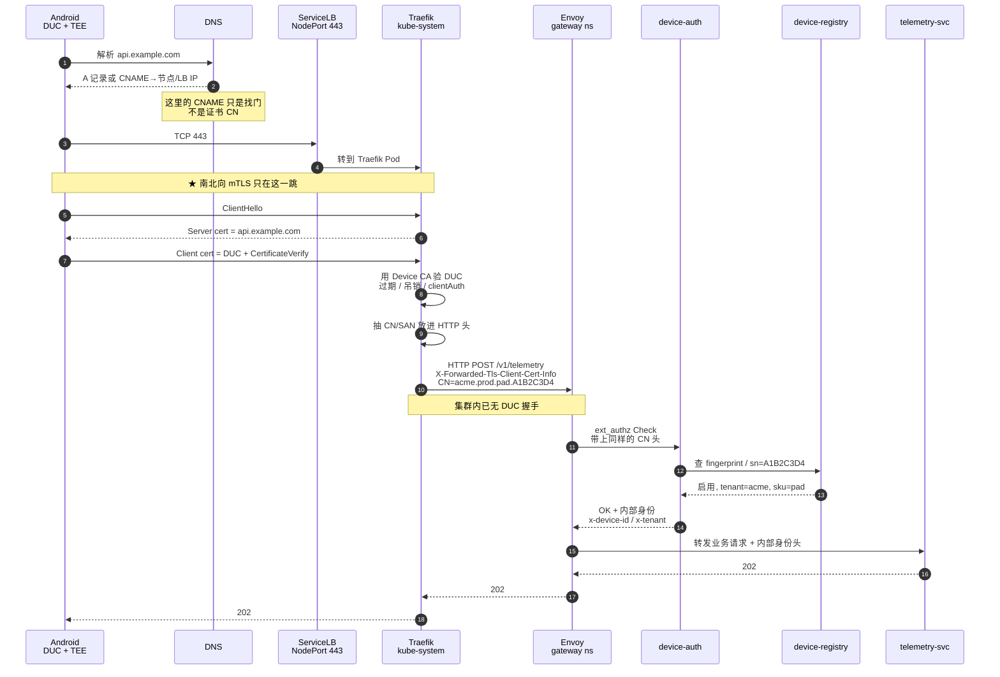
```mermaid
sequenceDiagram
    autonumber
    participant Dev as Android<br/>DUC + TEE
    participant DNS as DNS
    participant SLB as ServiceLB<br/>NodePort 443
    participant Tr as Traefik<br/>kube-system
    participant Ey as Envoy<br/>gateway ns
    participant Auth as device-auth
    participant Reg as device-registry
    participant Tel as telemetry-svc

    Dev->>DNS: 解析 api.example.com
    DNS-->>Dev: A 记录或 CNAME→节点/LB IP
    Note over DNS: 这里的 CNAME 只是找门<br/>不是证书 CN

    Dev->>SLB: TCP 443
    SLB->>Tr: 转到 Traefik Pod

    Note over Dev,Tr: ★ 南北向 mTLS 只在这一跳
    Dev->>Tr: ClientHello
    Tr-->>Dev: Server cert = api.example.com
    Dev->>Tr: Client cert = DUC + CertificateVerify
    Tr->>Tr: 用 Device CA 验 DUC<br/>过期 / 吊销 / clientAuth
    Tr->>Tr: 抽 CN/SAN 放进 HTTP 头

    Tr->>Ey: HTTP POST /v1/telemetry<br/>X-Forwarded-Tls-Client-Cert-Info<br/>CN=acme.prod.pad.A1B2C3D4
    Note over Tr,Ey: 集群内已无 DUC 握手

    Ey->>Auth: ext_authz Check<br/>带上同样的 CN 头
    Auth->>Reg: 查 fingerprint / sn=A1B2C3D4
    Reg-->>Auth: 启用, tenant=acme, sku=pad
    Auth-->>Ey: OK + 内部身份<br/>x-device-id / x-tenant

    Ey->>Tel: 转发业务请求 + 内部身份头
    Tel-->>Ey: 202
    Ey-->>Tr: 202
    Tr-->>Dev: 202
```

对应到「谁在哪一层」：

```text
L2 mTLS 握手 Traefik ←→ Android
L3 抽出 CN Traefik （写入 X-Forwarded-Tls-Client-Cert-Info）
L3' 解释 CN + 查档案 device-auth （被 Envoy ext_authz 调用）
L4 业务授权/处理 telemetry-svc / command-svc
```

如果走拼法 A，把上面 Envoy 那一跳删掉：Traefik 直接把带 CN 头的请求打到 device-auth，device-auth 再反向代理或让客户端打到其它服务。顺序变成 `1 DNS → 2 LB → 3 Traefik(mTLS) → 4 device-auth → 5 业务服务`。

### 6.1 领证请求走另一条 Path（不要和业务混）

CSR 提交 **也进同一个 k3s**，但应是另一条 Ingress 规则，尽量不要要求设备已经有 DUC （鸡生蛋）。常见是出厂凭证 / 一次性 bootstrap 证书 / 激活码。

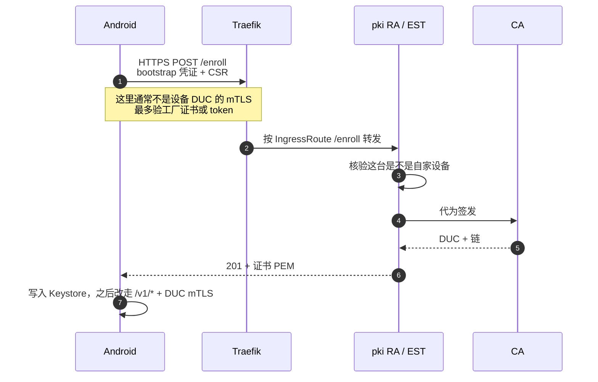
```mermaid
sequenceDiagram
    autonumber
    participant Dev as Android
    participant Tr as Traefik
    participant RA as pki RA / EST
    participant CA as CA

    Dev->>Tr: HTTPS POST /enroll<br/>bootstrap 凭证 + CSR
    Note over Dev,Tr: 这里通常不是设备 DUC 的 mTLS<br/>最多验工厂证书或 token
    Tr->>RA: 按 IngressRoute /enroll 转发
    RA->>RA: 核验这台是不是自家设备
    RA->>CA: 代为签发
    CA-->>RA: DUC + 链
    RA-->>Dev: 201 + 证书 PEM
    Dev->>Dev: 写入 Keystore，之后改走 /v1/* + DUC mTLS
```

Traefik 上就是两条路由，位置相同、策略不同：

```text
Host(api.example.com) && PathPrefix(`/enroll`) → pki-ra:8080 不要求 DUC
Host(api.example.com) && PathPrefix(`/v1`) → envoy:8080 require 设备 DUC
```

### 6.2 Traefik / Envoy 把 CN 往下传（概念配置）

Traefik（Ingress edge，**验 DUC + 抽字段**）：

```yaml
# 概念：真实字段名随 Traefik 版本略有差异
tls:
  options:
    device-mtls:
      clientAuth:
        caFiles:
          - /pki/device-ca.pem      # Device CA，不是 Server CA
        clientAuthType: RequireAndVerifyClientCert

# passTLSClientCert middleware：把证书 Subject/CN 放进下游头
```

Envoy（第二跳，**已经看不到 DUC**，只做 ext_authz）：

```yaml
# 概念
http_filters:
  - name: envoy.filters.http.ext_authz
    typed_config:
      grpc_service:
        envoy_grpc:
          cluster_name: device-auth
# 把 Traefik 传来的 X-Forwarded-Tls-Client-Cert-Info 原样带给 device-auth
```

device-auth 仍然只做后面「解析 CN」那种 `split('.')` / 查 registry。它不实现 TLS。

### 6.2.1 Traefik 要配哪把 CA、写在哪

要。Traefik 必须装 **签发 DUC 的那把 Device CA 的 CA cert**（public 的 PEM），作为 client mTLS 的 trust anchor。不要装 Device CA 的 private key，也不要把 Server CA 塞进 `clientAuth`。

两把 CA 在 Traefik 上是 **两个不同的配置项**：

| 配什么 | 干什么 | 配置位置 |
|---|---|---|
| **Device CA** | 验设备出示的 DUC | `clientAuth`（k3s 上是 `TLSOption`；compose 上是 `caFiles`） |
| **api.example.com 的 server cert** | Traefik 自己亮给设备的证（由 Server CA 签） | IngressRoute `tls.secretName` / compose `tls.certificates` |

k3s 默认 Traefik **不用改 Traefik 容器启动参数**，也不用把 PEM 手工 mount 进 Pod。写三个 Kubernetes 对象即可：Secret → TLSOption → IngressRoute 引用它。lab 里就是 `local-mtls-lab/k8s/resources.yaml` + `k3d-up.sh`。

**1. Secret 里放 Device CA cert**（key 必须叫 `ca.crt`，Traefik 只认这个名字）：

```bash
kubectl -n device-platform create secret generic device-ca \
  --from-file=ca.crt=pki/device-ca.crt
```

**2. TLSOption：要求并校验 client cert**

```yaml
apiVersion: traefik.io/v1alpha1
kind: TLSOption
metadata:
  name: mtls
  namespace: device-platform
spec:
  clientAuth:
    secretNames:
      - device-ca
    clientAuthType: RequireAndVerifyClientCert
```

**3. 业务 IngressRoute 挂上这个 option**（`/enroll` 不要挂，否则没 DUC 的设备领不了证）：

```yaml
# IngressRoute.spec.tls
tls:
  secretName: api-tls          # Traefik 的 server cert（Server CA 签的）
  options:
    name: mtls                 # 上面那个 TLSOption
    namespace: device-platform
```

docker compose 没有 CRD，CA 文件直接 mount 进容器，写在 `local-mtls-lab/traefik/dynamic.yml`：

```yaml
tls:
  options:
    mtls:
      clientAuth:
        caFiles:
          - /pki/device-ca.crt     # compose 把 ./pki 挂到 /pki
        clientAuthType: RequireAndVerifyClientCert
  certificates:
    - certFile: /pki/api.mtls.local.crt    # 仍是 server cert，不是 Device CA
      keyFile: /pki/api.mtls.local.key
```

`docker-compose.yml` 只负责把文件送进去：`./pki:/pki:ro` 和 `./traefik/dynamic.yml:/etc/traefik/dynamic.yml:ro`。

换 CA / 轮 Device CA 时：更新 Secret 或 `device-ca.crt` 文件，等 Traefik reload。设备上的 DUC 必须仍是这把（或新）CA 签的，否则握手失败。

### 6.2.2 Traefik 会不会 wipe request headers

**不会把所有头都清掉。** Cookie、Authorization、你自己的 `X-Device-Id`，原样转发。

它只对一份 **自己管的 `X-Forwarded-*` 名单** 动手。其中和 cert 有关的两个名字是：

| header | 谁写 | 设备自己带过来会怎样 |
|---|---|---|
| `X-Forwarded-Tls-Client-Cert-Info` | `passTLSClientCert` 的 `info` | 默认 **先删再写** |
| `X-Forwarded-Tls-Client-Cert` | `passTLSClientCert` 的 `pem: true` | 默认 **先删再写** |

顺序：

```text
设备 HTTP 头（可能伪造 Cert-Info）
        ↓
entrypoint forwardedHeaders
  默认 trustedIPs 为空 = 谁都不在里面 → 一律 Del 上面那两个（以及 X-Forwarded-For 等）
  只有来源 IP 落在你显式写进 trustedIPs 的网段里，才保留客户端带来的这些头
        ↓
passTLSClientCert middleware
  从这次 TLS 握手的 PeerCertificates 再 Set 回去
        ↓
下游看到的是握手里那张 DUC，不是设备 HTTP 里写的
```

默认 `forwardedHeaders.insecure=false`、`trustedIPs` 为空：所有直连 Traefik 的客户端都是 untrusted，伪造的 `X-Forwarded-Tls-Client-Cert-Info` 进不了后端。lab 的 whoami 看到的那一列，就是 middleware **注入**的，不是设备带来的。

三件不要搞错：

1. **自定义名字 Traefik 不管。** `X-Client-CN`、`X-SSL-Client-Cert-Info`、`X-Cert-Info` 不在名单里，**不会 wipe**。设备可以随便带。文档前面图里的 `X-Client-CN` 是概念名；生产请读 Traefik 注入的 `X-Forwarded-Tls-Client-Cert-Info`，或者用 Headers middleware **先删** `X-Client-CN` 再自己写。
2. **不要开 `forwardedHeaders.insecure=true`。** 开了就不删客户端带来的 `X-Forwarded-*`。若再没挂 `passTLSClientCert`，后端会信伪造的 Cert-Info。
3. **绕过 Traefik 直打 ClusterIP，wipe 帮不上。** 那是 NetworkPolicy 的事。Traefik 只保证「经过我的请求」上那两个头可信。

`RequireAndVerifyClientCert` 下没有 DUC 根本进不了 HTTP；有 DUC 时 middleware 会 `Set` 覆盖同名头。真正要防的是：读错了头的名字，或有人从集群内伪造。

### 6.2.3 `trustedIPs` 必须配吗

**不必。** 不写就是空列表。`insecure=false`（默认）且 `trustedIPs` 为空时，`isTrustedIP` 恒为 false：每个直连客户端的 `X-Forwarded-*` 都会被删掉。设备直连 Traefik 时，这就是你要的。

只在 **Traefik 前面还有一台 HTTP 代理**、并且你要保留它写的 `X-Forwarded-For` / Proto 时才填，而且只填那台代理的 CIDR：

```yaml
# 只有前面真有 LB 时才加。不要写 0.0.0.0/0。
entryPoints:
  websecure:
    forwardedHeaders:
      trustedIPs:
        - 10.0.0.0/8    # 你的 LB，不是设备
```

| 部署 | `trustedIPs` |
|---|---|
| 设备 → k3s ServiceLB → Traefik | **留空**。ServiceLB 是 DNAT，不写 HTTP 头；源 IP 仍是设备 |
| 设备 → Cloudflare / 公司 LB（会写 `X-Forwarded-For`）→ Traefik | 填 **LB 的网段**，否则真实客户端 IP 被删掉，日志里只剩 LB |
| `0.0.0.0/0` 或 `insecure: true` | 等于谁都信。伪造的 Cert-Info 能活过 wipe |

cert 头本身不靠 `trustedIPs` 才可信：`passTLSClientCert` 总是从这次握手重写。`trustedIPs` 管的是「前面那跳的 `X-Forwarded-For` 留不留」。

### 6.3 东西向：Envoy sidecar 在请求末尾还会再跳一次

若集群开了 mesh，业务服务之间还有一跳，**和设备无关**：

```text
telemetry-svc → 本 Pod 的 Envoy sidecar --mesh mTLS--> registry 的 Envoy sidecar → registry
```

这套证书来自 mesh CA （Istio/SPIRE），CN 是 `spiffe://cluster/ns/device-platform/sa/telemetry`。 
不要和设备 CN `acme.prod.pad.A1B2C3D4` 当成同一种东西。

---

## 7. 端到端时序：从出厂到第一次业务 API（落到 k3s 组件）

把第 6 节的 hop 和第 3 节的两阶段拼在一起。PKI RA/CA、Traefik、Envoy、device-auth 都跑在 **同一个 k3s** 里，只是 namespace / Ingress Path 不同。

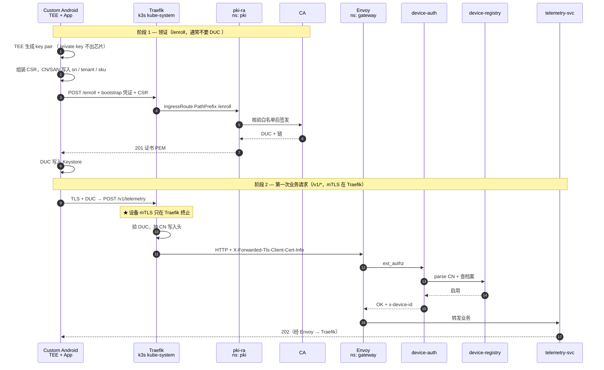
```mermaid
sequenceDiagram
    autonumber
    participant Dev as Custom Android<br/>TEE + App
    participant Tr as Traefik<br/>k3s kube-system
    participant RA as pki-ra<br/>ns: pki
    participant CA as CA
    participant Ey as Envoy<br/>ns: gateway
    participant Auth as device-auth
    participant Reg as device-registry
    participant Tel as telemetry-svc

    Note over Dev,CA: 阶段 1 — 领证（/enroll，通常不要 DUC ）
    Dev->>Dev: TEE 生成 key pair （ private key 不出芯片）
    Dev->>Dev: 组装 CSR，CN/SAN 写入 sn / tenant / sku
    Dev->>Tr: POST /enroll + bootstrap 凭证 + CSR
    Tr->>RA: IngressRoute PathPrefix /enroll
    RA->>CA: 核验白名单后签发
    CA-->>RA: DUC + 链
    RA-->>Dev: 201 证书 PEM
    Dev->>Dev: DUC 写入 Keystore

    Note over Dev,Tel: 阶段 2 — 第一次业务请求（/v1/*，mTLS 在 Traefik）
    Dev->>Tr: TLS + DUC → POST /v1/telemetry
    Note over Tr: ★ 设备 mTLS 只在 Traefik 终止
    Tr->>Tr: 验 DUC，抽 CN 写入头
    Tr->>Ey: HTTP + X-Forwarded-Tls-Client-Cert-Info
    Ey->>Auth: ext_authz
    Auth->>Reg: parse CN + 查档案
    Reg-->>Auth: 启用
    Auth-->>Ey: OK + x-device-id
    Ey->>Tel: 转发业务
    Tel-->>Dev: 202（经 Envoy → Traefik）
```

三处位置对照组件：

1. **CSR**：阶段 1，设备 → Traefik `/enroll` → **pki-ra / CA**。 
2. **mTLS**：阶段 2，设备 ↔ **Traefik**。Envoy 和微服务已经是 HTTP。 
3. **解析 CN**：Traefik 抽字段；**device-auth** 解释字段并查 registry。这是 mTLS 成功之后的事。

---

## 8. 后台怎么「解析 CN 里的字段」

假设签发时约定 CN 格式：

```text
CN = {tenant}.{env}.{sku}.{deviceId}
例: acme.prod.pad.A1B2C3D4
```

后台逻辑概念上就是：

```text
1. 读 Traefik 注入的 X-Forwarded-Tls-Client-Cert-Info
   不要读 X-Client-CN / X-Client-Verify：Traefik 不写这两个，也不删，设备可以伪造
   NetworkPolicy 禁止绕过 Ingress 直打 ClusterIP
2. 从 Cert-Info 的 Subject 里取出 CN（值是 URL-encoded）
3. tenant, env, sku, deviceId = cn.split(".")
4. 查 Device Registry:
 - 这张证书序列号 / fingerprint 是否登记过
 - 设备是否停用、是否被吊销
 - sku 是否允许这个 API
5. 通过后，deviceId 成为本次请求的「设备主体」
```

更稳的做法是 **不要把关键身份只放 CN**（CN 长度、字符集都容易撞规范），而是：

| 放哪 | 用途 |
|---|---|
| 证书序列号 / fingerprint | 主键，吊销、轮转、审计 |
| SAN URI | 结构化身份（tenant/sku/sn） |
| CN | 给人看、给日志用 |
| 后台 Device Registry | 把 fingerprint 映射到业务设备档案 |

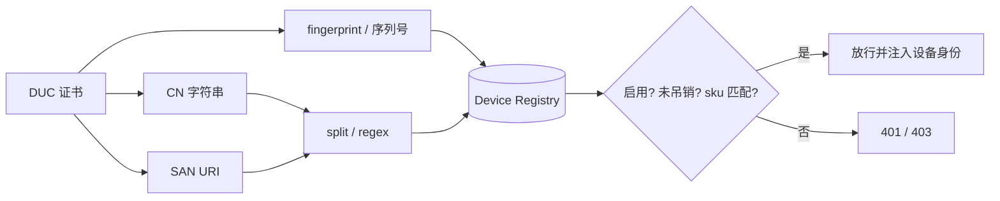
```mermaid
flowchart LR
    CERT[DUC 证书] --> FPR[fingerprint / 序列号]
    CERT --> CN[CN 字符串]
    CERT --> SAN[SAN URI]

    FPR --> REG[(Device Registry)]
    CN --> PARSE[split / regex]
    SAN --> PARSE
    PARSE --> REG
    REG --> DEC{启用? 未吊销? sku 匹配?}
    DEC -->|是| OK[放行并注入设备身份]
    DEC -->|否| NO[401 / 403]
```

### 8.1 fingerprint 是什么、怎么算、干什么用

**fingerprint**（有时叫 thumbprint）= 这张证书 DER 字节的哈希，通常是 **SHA-256**。它标识的是 **这一张具体的 cert 文件**，不是 CN 里的 deviceId。

```bash
openssl x509 -in dummy-duc.crt -noout -fingerprint -sha256
# sha256 Fingerprint=AB:CD:...
```

实现就是：`SHA256(cert 的 DER)`。同一张 PEM 每次算出来一样；你改一个字段、CA 重签一张，fingerprint 立刻变。

| 拿它当什么 | 为什么需要 | 不拿 CN 行不行 |
|---|---|---|
| Device Registry 主键 | 登记「这张已签发的 DUC ↔ 业务设备」 | CN 可以重签、可以撞格式；fingerprint 绑死这一张 |
| 吊销 / 轮转 | 旧 DUC 过期或召回：把这条 fingerprint 标 invalid，新 enroll 写入新 fingerprint | CN 往往不变，只看 CN 分不清新旧证 |
| 审计日志 | 日志里记下「哪张证进来的」 | CN 给人看，fingerprint 给对账 |
| 可选 pinning | 期望对端必须是这一张（或这一把 CA） | 比信任整棵 CA 更死，轮证会痛 |

**机理（和 mTLS 的分工）**：

1. Traefik 用 Device CA 做 **trust anchor**，只回答：这张 DUC 是不是自家 CA 签的、有没有过期/吊销。  
2. 通过之后，`passTLSClientCert` 把勾选的字段写进 `X-Forwarded-Tls-Client-Cert-Info`（CN、SAN、serial）。**这个头里没有 fingerprint。** 要 fingerprint：打开 `pem: true`，由 device-auth 对 PEM 做 SHA-256；或只用 serial 去 Registry 对。  
3. **device-auth** 用 fingerprint 去 Registry 查：这台业务上是否启用。TLS 通过不等于业务允许——被召回的设备 cert 可能还没进 CRL，但 Registry 已经关掉。

```text
mTLS 成功     =  密码学上这张 DUC 合法
fingerprint 命中 =  业务上我们认这张证、这台设备
```

不要用 fingerprint 代替 trust anchor：你不可能在 Traefik 里预置一万台设备的 fingerprint 当信任根。trust anchor 一次信任一把 CA；fingerprint 是签发之后、业务层认领「这一张」。

### 8.2 Device Registry 一般以什么形式存在

它 **不是** k8s Secret，也 **不是** CA。CA 负责签发 DUC；Registry 是 **业务侧的设备档案**，几乎总是：

**一个 Postgres（或 MySQL）表 + 前面一个 device-registry / device-auth 服务。** 热路径会再加 Redis 缓存 fingerprint → 档案。

典型表（概念上，名字随意）：

```text
devices
  device_id          业务主键（出厂 SN / 你们自己的 UUID）
  tenant, sku, env
  status             active | disabled | recalled
  current_fingerprint   当前 DUC 的 SHA-256
  cert_serial
  enrolled_at, last_seen_at

device_certs          一张设备会有多张证（轮转史）
  fingerprint        PK
  device_id          FK
  not_before, not_after
  status             current | rotated | revoked
```

存在形式对照：

| 形态 | 什么时候用 | 不是什么 |
|---|---|---|
| **Postgres 行** | 默认。要事务、审计、按 tenant 查 | 不是 cert 本身，不放 PEM |
| **Redis** | 每个业务请求用 fingerprint 做一次 Redis GET；hit 就不用查 Postgres | 只是缓存，权威仍在 DB |
| **IoT 平台 Thing Registry** | AWS IoT / Azure DPS 一类，云托管同构物 | 自己做 k3s 时通常仍是一张表 |
| **MDM / 出厂工单库** | enroll 时写入第一行（这台 SN 允许领证） | 和运行时 Registry 可以是同一库的不同表 |
| **k8s CRD** | 设备很少、当配置用 | 上万台 device 不要当 K8s 对象 |

读写路径：

- **enroll**：RA 签发 DUC 成功 → `INSERT` / 更新 `current_fingerprint`。  
- **每次业务请求**：device-auth 用 Traefik 转来的 fingerprint 查 Registry（先 Redis GET，miss 再 Postgres）。这个读必须快，所以常走 Envoy `ext_authz`。  
- **召回 / 停用**：改 `status`，不必等 CRL 传播；Traefik 仍可能 mTLS 成功，Registry 拒绝即可。  
- **轮证**：旧 fingerprint → `rotated`，新的变成 `current`。

图里的 `device-registry` 就是这个服务；数据躺在它后面的 **SQL**，不是 Traefik 配置，也不是 TEE。

---

## 9. TEE 是什么：设备上 key 实际住哪

**TEE = Trusted Execution Environment。** 
芯片里和普通 Android（REE）隔离的 **vault**：有自己的内核、内存、key storage。普通 App、哪怕拿到 root，也读不到里面的 private key 字节。

对照这套设备认证：

| 词 | 它是什么 | 在这套方案里干什么 |
|---|---|---|
| **REE** | Rich Execution Environment：日常 Android（App、Java/Kotlin、Linux） | 组 CSR、跑 TLS、连 Traefik。**看不到 private key。** |
| **TEE** | SoC 上划出来的 secure world（ARM 上通常是 TrustZone） | **生成并保管设备 private key**；真正做 CSR signature 和 mTLS 的 `CertificateVerify` |
| **Android Keystore** | REE 里的 API | App 只拿得到一个 alias（handle），说「请签一下」；Keystore 把运算转进 TEE |
| **StrongBox** | 比 TEE 更硬：独立 Secure Element，不是 CPU 里切出来的分区 | 有的 custom 设备用它存 DUC private key；API 仍走 Keystore，`setIsStrongBoxBacked(true)` |
| **DUC** | PKI 签出来的 client cert | 可以放在 REE（证书是公开的）；配对的 private key 必须留在 TEE / StrongBox |

一句话：**Keystore = API，TEE / StrongBox = vault，DUC = 只有 public key 的 client cert。**

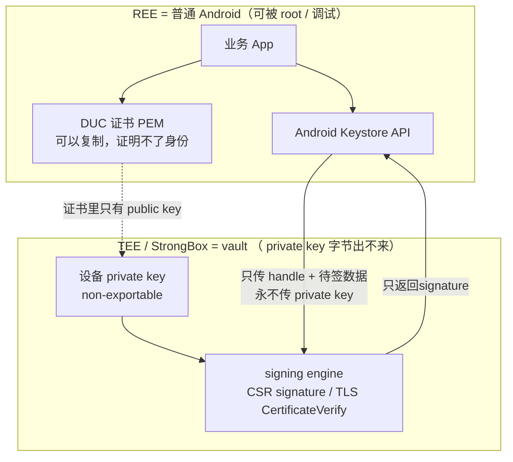
```mermaid
flowchart TB
    subgraph REE["REE = 普通 Android（可被 root / 调试）"]
        APP[业务 App]
        AKS[Android Keystore API]
        CERT[DUC 证书 PEM<br/>可以复制，证明不了身份]
        APP --> AKS
        APP --> CERT
    end

    subgraph TEE["TEE / StrongBox = vault （ private key 字节出不来）"]
        PRIV[设备 private key<br/>non-exportable]
        SIGN[signing engine<br/>CSR signature / TLS CertificateVerify]
        PRIV --> SIGN
    end

    AKS -->|"只传 handle + 待签数据<br/>永不传 private key"| SIGN
    SIGN -->|"只返回signature"| AKS
    CERT -.->|证书里只有 public key| PRIV
```

没有 TEE 时，private key 若是普通文件（`/data/.../client.key`），root、备份、镜像拷贝都能把「这台设备」复制走。有 TEE 时，别人最多偷到 DUC （公开证书），没有 vault 里的 private key 就过不了 Traefik 的 mTLS。

### 9.1 它在请求路径上的位置

TEE **不出现在 k3s 那一侧**。它只在 Android 设备内部，而且只在两件事发生时被叫醒：

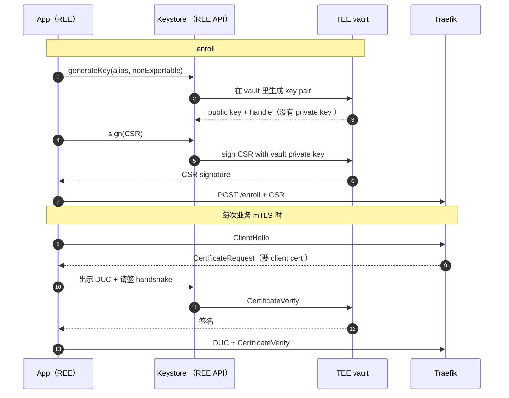
```mermaid
sequenceDiagram
    autonumber
    participant App as App（REE）
    participant KS as Keystore （REE API）
    participant TEE as TEE vault
    participant Tr as Traefik

    Note over App,TEE: enroll
    App->>KS: generateKey(alias, nonExportable)
    KS->>TEE: 在 vault 里生成 key pair
    TEE-->>KS: public key + handle（没有 private key ）
    App->>KS: sign(CSR)
    KS->>TEE: sign CSR with vault private key
    TEE-->>App: CSR signature
    App->>Tr: POST /enroll + CSR

    Note over App,Tr: 每次业务 mTLS 时
    App->>Tr: ClientHello
    Tr-->>App: CertificateRequest（要 client cert ）
    App->>KS: 出示 DUC + 请签 handshake
    KS->>TEE: CertificateVerify
    TEE-->>App: 签名
    App->>Tr: DUC + CertificateVerify
```

所以文档前面写「 private key 永远不出设备」，更精确是：**private key 永远不出 TEE**。CSR、DUC、HTTP、Traefik 看到的都只是 public key 和signature。

### 9.2 和这套 PKI 的对应关系

```text
TEE private key = 这台机器的 signing key（non-exportable）
CSR = 用这把 key 签过名的 Certificate Signing Request
PKI / CA = 只看 CSR 和 public key，然后签发
DUC = CA 签完的 client cert（公开）
mTLS = Traefik 校验：对端能否用同一把 key 再签一次 handshake
```

Traefik 验的是「签名是否对应这张 DUC 里的 public key，且 DUC 是否由 Device CA 签发」。它 **不知道、也不需要知道** private key 是 TEE、StrongBox 还是软件 Keystore 生成的。 
若你要后台也确信「这把 key 真的在硬件里」，那是另一件事：**Key Attestation**（TEE 再签一份「我是硬件生成的」证明，随 CSR 一起交给 RA）。那是增强，不是 mTLS 本身。

### 9.3 设备侧组件怎么叠

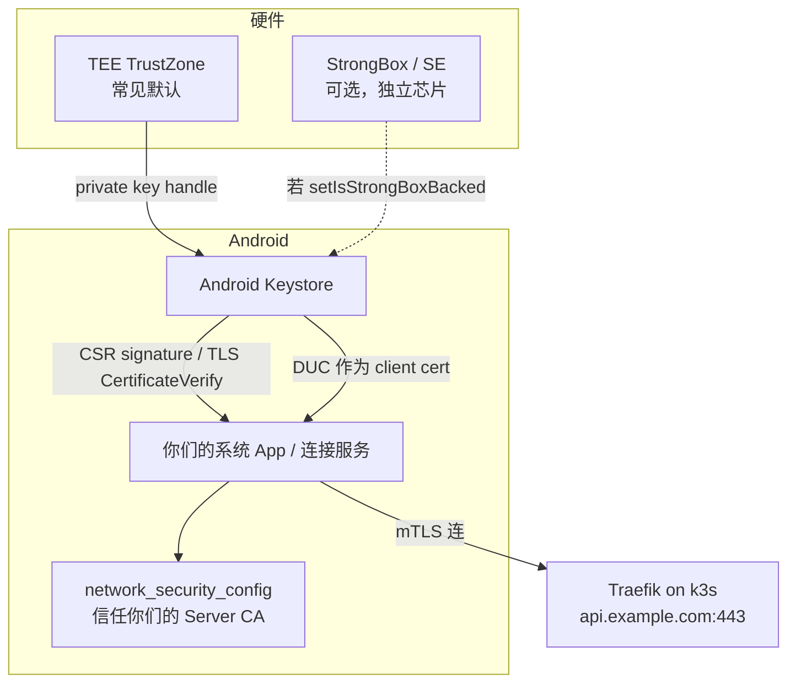
```mermaid
flowchart TB
    subgraph 硬件
        TEE[TEE TrustZone<br/>常见默认]
        SB[StrongBox / SE<br/>可选，独立芯片]
    end

    subgraph Android
        AKS[Android Keystore]
        APP[你们的系统 App / 连接服务]
        NSC[network_security_config<br/>信任你们的 Server CA]
    end

    TEE -->|private key handle| AKS
    SB -.->|若 setIsStrongBoxBacked| AKS
    AKS -->|CSR signature / TLS CertificateVerify| APP
    AKS -->|DUC 作为 client cert| APP
    APP --> NSC
    APP -->|mTLS 连| GW[Traefik on k3s<br/>api.example.com:443]
```

要点：

- **private key**：出厂或首次启动时在 TEE（或 StrongBox）生成，`non-exportable`。CSR 只带走 public key。 
- **DUC**：public key 被 CA 签发后的 client cert，可以备份文件，但不能单独冒充设备（没有 private key）。 
- **服务器 trust anchor**：设备要内置/预置你们 API 的 CA （或系统信任 + pinning），否则它无法验证对面是真后台。 
- **客户端 trust anchor**：Traefik 要挂签发 DUC 的 Device CA。这是 mTLS 的另一半。

所以 mTLS 需要 **两套 PKI**，不要混成一张图里的同一把 CA：

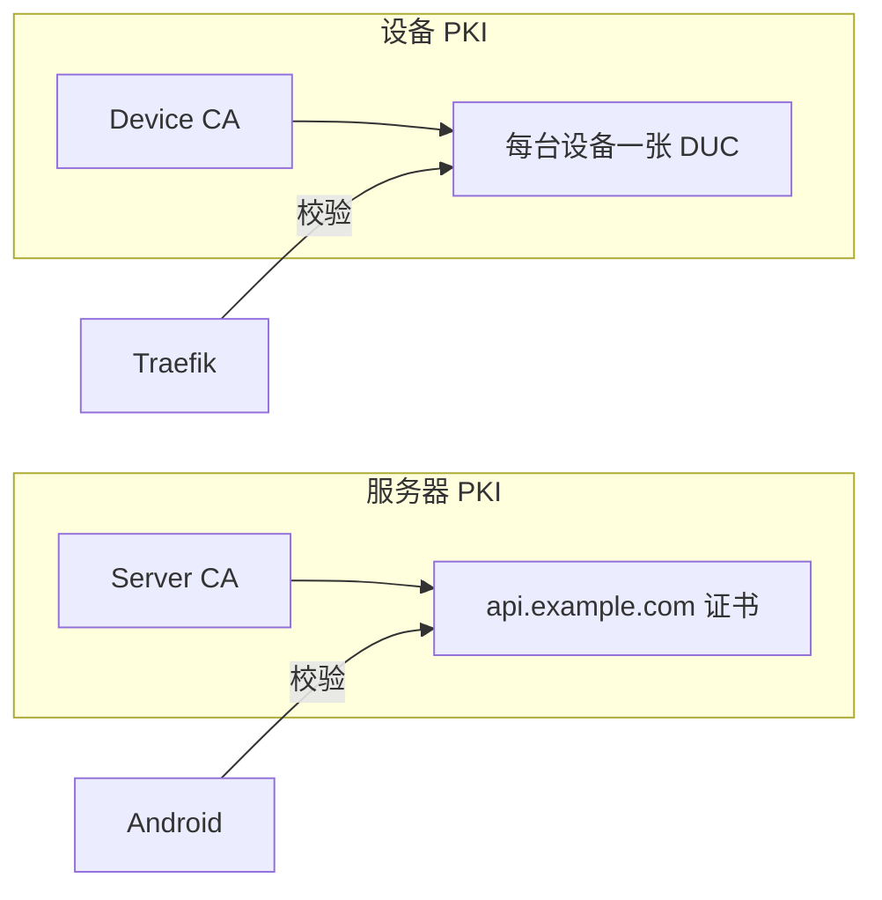
```mermaid
flowchart LR
    subgraph 服务器 PKI
        SCA[Server CA] --> SCERT[api.example.com 证书]
    end

    subgraph 设备 PKI
        DCA[Device CA] --> DUC[每台设备一张 DUC]
    end

    DEV[Android] -->|校验| SCERT
    GW[Traefik] -->|校验| DUC
```

设备用 Server CA 认 `api.example.com`（证书常常由 cert-manager 签给 Traefik）；Traefik 用 Device CA 认 DUC。这才叫 mutual。

### 9.4 trust anchor 是什么、装在哪、怎么用

**trust anchor** = 校验 cert chain 时，你预先信任的那张 **CA cert**（通常是 Root CA，有时是中间 CA）。验证算法不会无条件相信对端塞过来的任何叶子证书，它会沿着 Issuer 往上走，直到碰到「我本地已经有的那张 CA」——碰不到就失败。

```text
对端出示的 leaf（DUC 或 api.example.com）
        ↑ 签名
中间 CA（可选）
        ↑ 签名
Root CA  ←  这一张预先躺在你机器上的，就是 trust anchor
```

RFC 5280 path validation 概念上就是：

1. 拿到 leaf + 对方给的 chain。  
2. 验 signature、有效期、KU / EKU（clientAuth 或 serverAuth）。  
3. 沿 issuer 往上走，直到 issuer **等于本地 trust store 里的某张 CA**。  
4. 走不到 → 握手失败。不看 CN 漂不漂亮。

**本方案有两个 trust anchor，分属两侧，不要装反：**

| 谁持有 | trust store 里放什么 | 用来验谁 | 本仓库对应文件 |
|---|---|---|---|
| Android | **Server CA**（或系统根 + pin） | Traefik 的 `api.example.com` server cert | `pki/server-ca.crt`；设备上是 `network_security_config` |
| Traefik | **Device CA** | 每台设备的 DUC | `pki/device-ca.crt`；k3s Secret `device-ca` / Traefik `caFiles` |

为什么要它：Traefik **不必**存一万张 DUC。只装一把 Device CA，所有它签过、未吊销的 DUC 都能过 mTLS。设备也 **不必** 预置 Traefik 叶子证书（叶子会轮换）；预置 Server CA 即可。

和 fingerprint 的关系：

```text
trust anchor  =  信哪一把 CA（一次信任一类证）
fingerprint   =  认哪一张已经签发的证（业务主键）
```

本地 `ssl_verify_client on` + `ssl_client_certificate device-ca.pem`，那份 pem 就是 Traefik 的 trust anchor。`curl --cacert server-ca.crt` 是 curl 侧的 trust anchor。

---

## 10. 和「用户登录」怎么叠

设备证书证明 **这是哪台机器**。它通常 **不证明** 这是哪个最终用户。常见叠法：

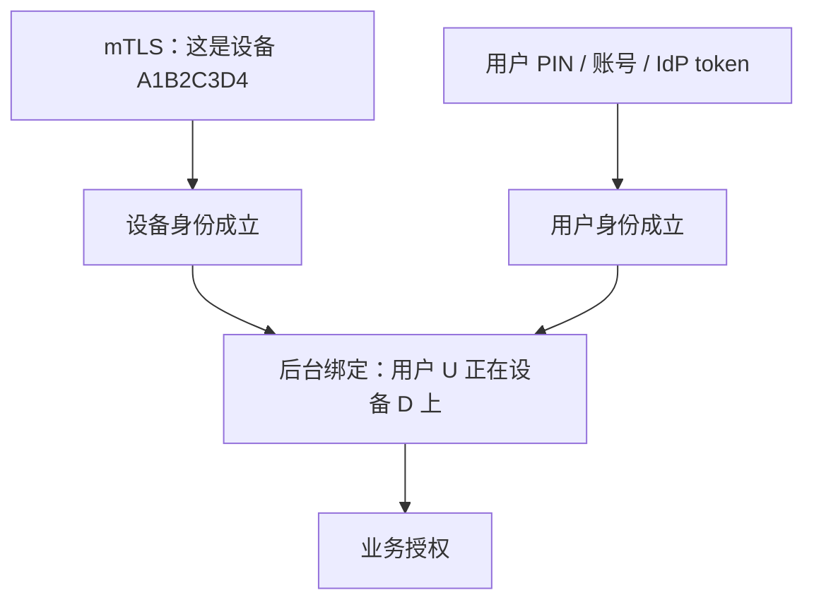
```mermaid
flowchart TB
    MTLS[mTLS：这是设备 A1B2C3D4] --> DEV_OK[设备身份成立]
    USER[用户 PIN / 账号 / IdP token] --> USER_OK[用户身份成立]
    DEV_OK --> BIND[后台绑定：用户 U 正在设备 D 上]
    USER_OK --> BIND
    BIND --> API[业务授权]
```

两种都常见：

1. **纯设备 auth**：Kiosk / 工控 / 专有终端，只有 DUC，没有用户。 
2. **设备 + 用户**：DUC 过 mTLS 之后，再在 TLS 之内用 OAuth/会话。token 偷了也用不了，因为没有那台设备的 private key。

---

## 11. 最小对照表（怕以后再混）

| 你听到的话 | 实际在哪 | 输入 | 输出 |
|---|---|---|---|
| 「 TEE 」 | 设备 SoC 里的 vault / TrustZone | 待签数据 + key handle | signature；private key 永不返回 |
| 「 Keystore 」 | Android API（REE） | alias / 生成参数 | 把运算转进 TEE |
| 「StrongBox」 | 可选 Secure Element | 同 Keystore | 比 TEE 更难被 CPU 侧漏洞打穿 |
| 「先生成 CSR 」 | App 组表，TEE signs | public key + 身份字段 | CSR 文件/PEM |
| 「交给 PKI 签」 | k3s `ns:pki` 的 CA | CSR + 出厂/激活证据 | DUC + cert chain |
| 「用 DUC 连后台」 | Android TLS 客户端 | DUC + private key handle | 连 Traefik:443 |
| 「k3s」 | 集群，不是一跳 | Pod / Service / Ingress | 承载 Traefik、Envoy、微服务 |
| 「 mTLS 」 | **Traefik 终止 TLS** | 设备 DUC + server cert | 握手成功 / 失败 |
| 「Traefik」 | k3s 默认 Ingress，north-south edge | 已建立的 mTLS 连接 | 按 Host/Path 转发，并把 CN 放入头 |
| 「Envoy」 | 可选第二跳或 sidecar | HTTP + CN 头（边缘）或 mesh 证书（sidecar） | ext_authz / 再路由 / 东西向 mTLS |
| 「解析 CN」 | Traefik 抽取 + **device-auth** split | Subject/SAN 头 | deviceId、tenant、sku… |
| 「典型微服务」 | ClusterIP 后的 Pod | 内部身份头，不是 DUC | 业务响应 |
| 「fingerprint」 | SHA-256(cert DER) | 一张具体的 DUC | Registry 主键、吊销、轮转、审计 |
| 「Device Registry」 | Postgres 表 + registry 服务（热路径 Redis） | fingerprint ↔ 业务设备 | 不是 CA，不是 k8s Secret，不存 PEM |
| 「trust anchor」 | 预置的 CA cert | leaf + chain | 握手能否连上这把 CA 签的证 |

---

## 12. 常见误解

1. **把 CN 当成 DNS CNAME** 
 证书 CN 是 client cert Subject 上的字段；DNS CNAME 只是找到 k3s ServiceLB。device-auth 读的是前者。

2. **以为 k3s / telemetry-svc 自己在做 mTLS**  
   设备 mTLS 在 **Traefik** 就结束了。微服务只读头。必须用 NetworkPolicy 禁止绕过 Ingress 直打 ClusterIP，否则 CN 头可伪造。

3. **以为 mTLS 是给 device 的、TLS 是给浏览器的**  
   两者都是 TLS。差别是 handshake 要不要 client cert。浏览器可以 mTLS，device 也可以只用普通 HTTPS + token。

4. **把 Envoy sidecar 的 mesh mTLS 当成设备 DUC**  
   两套证书。edge 是 Device CA 签的 DUC；Pod 之间是 mesh CA 签的 SPIFFE 身份。

5. **Traefik 和 Envoy 各 require 一次 client cert**  
   DUC 在 Traefik 终止后下游是 HTTP。Envoy 再 `require_client_certificate` 会失败。第二跳只吃头，或改用 TLS passthrough（少见）。

6. **以为 CSR 里写了 CN，后台就该信**  
   CA 必须按模板校验 CSR 字段（设备是否在白名单、tenant 是否匹配工单）。否则谁都能自报 `CN=admin`。

7. **设备和服务器共用一把 CA**  
   能做，但不清晰。推荐 Server CA（给 Traefik 的 `api.example.com`）与 Device CA（给每台 DUC）分开。

8. **DUC 过期还继续用 token**  
   证书轮转要在过期前用旧 DUC 走 `/enroll` 换新 CSR。轮转本身也进同一套 Traefik，只是 Path 不同。

9. **把 TEE 当成一种证书或一种 gateway**  
   TEE 是设备里的 vault，不是 DUC，也不是 Traefik。k3s 集群完全看不见它；只有 Android 在 signing 时用到。

10. **Keystore 里「导出 private key」失败就以为没生成成功**  
    `non-exportable` 是特性：能签、不能读。这正是 TEE 要保证的。

11. **把 Device Registry 当成 CA 或 Traefik 配置**  
    Registry 是业务档案（SQL）。CA 签发 DUC；Traefik 验 PKI；Registry 回答「这台业务上开没开」。

12. **以为 Traefik 会 wipe 所有 `X-*` 头**  
    只 wipe 它名单里的 `X-Forwarded-*`（含 `X-Forwarded-Tls-Client-Cert-Info`）。`X-Client-CN` 这种自定义名不会删，设备可以伪造。下游要读 Traefik 注入的那个头，并且 NetworkPolicy 挡住直打 ClusterIP。

---

## 13. 读完后你应该能回答的几句话

1. **CSR** 是设备拿 public key 去请求签发的 Certificate Signing Request；**PKI** 是 CA 体系（k3s 里通常是独立 `pki` namespace）；**DUC** 是签完、只属于这台 Android 的 client cert。 
2. **k3s 是 cluster**；请求顺序是 `DNS → ServiceLB → Traefik（★ 设备 mTLS）→ 可选 Envoy → device-auth（解析 CN）→ 业务微服务`。 
3. **Traefik** 验 DUC 并抽 CN；**Envoy** 可选地做 ext_authz / 再路由 / 东西向 mTLS；**典型微服务** 不握手，只认内部身份。 
4. **后台解析的 CN 是 client cert Subject 上的字段**，能信是因为 Traefik 已经用 Device CA 验证过这张 DUC。 
5. **TEE** 是 SoC 上保管 private key 的 vault；**Keystore** 只是 App 调用它的 API。没有这把出不了 vault 的 private key，DUC 只是一张公开的 client cert。 
6. **Device Registry** 一般是 Postgres 里的设备档案（fingerprint、sn、sku、启用/召回），前面一个 registry 服务；不是 CA，也不是 Traefik。

---

## 14. 本地端到端怎么 mimic：Traefik + dummy DUC + k3s

可以，整条链都能在本地跑。本地把 Android/TEE 换成 **openssl 签出来的文件证书**，其余路径和生产一样：

```text
curl --cert dummy-duc.crt --key dummy-duc.key
  → Traefik（验 Device CA、抽 CN）
  → whoami / 你的 service
```

**不能**只用一个写着 CN 的 `.txt` 冒充 DUC。Traefik 要验的是 Device CA 签过的 X.509 client cert：有 public key、有 `clientAuth`、并且被 Device CA 签过。`.txt` 只适合当备忘录（这个 dummy 的 CN 是什么）。

```mermaid
flowchart LR
    subgraph 生产
        TEE[Android TEE private key] --> DUC1[DUC]
        DUC1 --> TR1[Traefik on k3s]
    end

    subgraph 本地
        FILE[openssl dummy-duc.key] --> DUC2[dummy-duc.crt<br/>CN=acme.dev.pad.LOCAL001]
        DUC2 --> TR2[同一套 Traefik]
    end

    TR1 --> SVC[service 读 CN 头]
    TR2 --> SVC
```

本地 **不 mimic TEE**（ private key 就在文件里，能被拷走）。要测的是 Traefik 验章、CN 转发、service 解析。这够后端联调。

### 14.1 文件放哪

都在仓库 `local-mtls-lab/`（相对本文件：同级目录）：

```text
local-mtls-lab/
 gen-pki.sh 生成本地两套 CA + dummy DUC
 pki/dummy-cn.txt 仅备忘：acme.dev.pad.LOCAL001（Traefik 不读这个文件）
 pki/dummy-duc.crt/.key ★ 真正给 curl 用的 dummy DUC
 pki/device-ca.crt Traefik 用来验 DUC 的 CA
 pki/server-ca.crt curl 用来验 api.mtls.local
 pki/api.mtls.local.* Traefik server cert
 docker-compose.yml 没有 k3s 时先用 Traefik 容器冒烟
 traefik/dynamic.yml compose 路径的 Traefik mTLS 配置
 k3d-up.sh 本地 k3s（k3d）+ 同一套证书
 k8s/resources.yaml whoami + TLSOption + IngressRoute
 curl-ok.sh / curl-fail.sh
```

`dummy-cn.txt` **不会**被 Traefik 读取。改 CN 必须重签证书，不要只改 txt：

```bash
cd local-mtls-lab
DUMMY_CN=acme.dev.pad.LOCAL002 ./gen-pki.sh
```

keys 被 `.gitignore` 了。换机器不要拷 `pki/*.key`，在新机器上重新跑 `./gen-pki.sh`。

### 14.2 三条测试深度（由浅到真）

**① 只测 service 怎么 parse CN（不是 mTLS ）**

跳过 Traefik，自己造头。适合改 `device-auth` 的内循环。生产必须禁止这条路径直打 ClusterIP。

```bash
kubectl -n device-platform port-forward svc/whoami 8080:80
curl -s http://127.0.0.1:8080/ \
 -H 'X-Forwarded-Tls-Client-Cert-Info: Subject="CN=acme.dev.pad.LOCAL001"'
```

**② Traefik 容器 + dummy DUC （真握手，没有 k3s）**

Docker daemon 可用、且当前用户能连上 daemon 时：

```bash
cd local-mtls-lab
chmod +x *.sh
./gen-pki.sh
docker compose up -d
./curl-ok.sh # 响应里应看到 CN=acme.dev.pad.LOCAL001
./curl-fail.sh # 不带证书，应失败
```

**③ 本地 k3s（k3d）整条链**

k3d 就是跑在 Docker 里的 k3s。Traefik 仍是 k3s 默认 Ingress，只是 Device CA / server cert 换成上面那套 dummy。

```bash
cd local-mtls-lab
chmod +x *.sh
./k3d-up.sh # 缺 k3d/kubectl 会装到 ~/.local/bin
./curl-ok.sh
```

请求顺序和文档第 6 节相同，只是设备变成 curl：

```text
curl(dummy DUC)
 → 127.0.0.1:8443 （compose 映射 或 k3d ServiceLB）
 → Traefik ★ mTLS
 → Service/whoami
```

whoami 会把 Traefik 注入的 `X-Forwarded-Tls-Client-Cert-Info` 打出来，里面有 `CN=acme.dev.pad.LOCAL001`。你自己的 service 换成读这个头（或再加一层 Envoy）即可，不必再碰证书文件。

② 和 ③ 都占用主机 `8443`，不要同时开。

### 14.3 本地刻意省略了什么

| 生产 | 本地 dummy |
|---|---|
| TEE 不可导出 private key | `dummy-duc.key` 就是普通文件 |
| PKI RA 审 CSR | `gen-pki.sh` 直接sign with CA private key |
| 真设备 SNI / trust anchor | `curl --resolve api.mtls.local:8443:127.0.0.1`（脚本已写好） |
| Envoy ext_authz | 先不加；whoami 已能证明 CN 过了 Traefik |

把 `whoami` 换成你的 `device-auth` Deployment、IngressRoute 指过去，就是同一条链上的真实微服务。

### 14.4 给另一台机器上的 agent：照做这份 playbook

把这一小节整段交给另一台机器的 agent。目标：在那台机器上复现「dummy DUC → Traefik mTLS → service 看到 CN」。不要重新发明架构，不要用 txt 当证书。

**任务**

1. 确认仓库里有 `local-mtls-lab/` 和本节列出的脚本。没有就按同目录结构补齐（`gen-pki.sh`、`docker-compose.yml`、`traefik/dynamic.yml`、`k3d-up.sh`、`k8s/resources.yaml`、`curl-ok.sh`、`curl-fail.sh`）。
2. 用 openssl 签发 **真的** dummy DUC （PEM），CN 默认 `acme.dev.pad.LOCAL001`。禁止把 `dummy-cn.txt` 配进 Traefik。
3. 先跑深度 ②（docker compose Traefik）。Docker 可用再跑深度 ③（k3d / 本地 k3s）。
4. 用 `curl-ok.sh` / `curl-fail.sh` 验证。把命令输出贴回给用户。

**前置**

- `openssl`（实验室用 3.x）
- `docker` 且当前用户能连 daemon（`docker info` 成功）。不要假设 `sudo docker` 一定能交互输密码。
- 深度 ③ 还需要能拉镜像、能在 `~/.local/bin` 装 k3d/kubectl（`k3d-up.sh` 会装）

**硬约束**

- dummy DUC = `pki/dummy-duc.crt` + `pki/dummy-duc.key`，由 `pki/device-ca.crt` 签发，EKU=`clientAuth`
- `pki/dummy-cn.txt` 只是备忘，改 CN 必须 `DUMMY_CN=... ./gen-pki.sh`
- 换机器不要复制 `pki/*.key`；在新机器重新 `./gen-pki.sh`
- 本地不模拟 TEE / Keystore / StrongBox
- 不要在 Traefik 和下游 service 上各 require 一次 client cert
- 不要为了「方便」把 Device CA 和 Server CA 合成一把（脚本已经分开）

**步骤（按顺序，失败就停并报告）**

```bash
# 0. 工作目录
cd local-mtls-lab
chmod +x gen-pki.sh curl-ok.sh curl-fail.sh k3d-up.sh

# 1. 签发 dummy PKI （即使 pki/ 里已有旧文件，换机器也应重签）
./gen-pki.sh
openssl x509 -in pki/dummy-duc.crt -noout -subject -ext subjectAltName
# 期望 subject 含 CN = acme.dev.pad.LOCAL001
# 期望 SAN 含 URI:urn:device:tenant=acme:env=dev:sku=pad:sn=LOCAL001
cat pki/dummy-cn.txt # 应与 CN 一致；此文件不是证书

# 2. Docker 是否可用
docker info >/tmp/docker-info.out 2>/tmp/docker-info.err
```

若 `docker info` 失败，先不要装 k3s。排查并写进报告：

| 现象 | 处理 |
|---|---|
| `Cannot connect ... ~/.docker/desktop/docker.sock` | Docker Desktop 没起来：启动它，或改用 `DOCKER_HOST=unix:///var/run/docker.sock` |
| `/var/run/docker.sock` 存在但 permission denied | 用户不在 `docker` 组；不要死循环 sudo 密码。告诉用户把该用户加入 `docker` 组后重登，或他们自己 `sudo docker compose up -d` |
| daemon inactive | `systemctl is-active docker`；需要用户启动 Docker |

Docker 可用之后：

```bash
# 3. 深度 ②：Traefik 容器，真 mTLS，没有 k3s
docker compose up -d
sleep 2
./curl-ok.sh
./curl-fail.sh
```

`curl-ok.sh` 等价于：

```bash
curl -sS --fail \
 --cacert pki/server-ca.crt \
 --cert pki/dummy-duc.crt \
 --key pki/dummy-duc.key \
 --resolve api.mtls.local:8443:127.0.0.1 \
 https://api.mtls.local:8443/v1/whoami
```

成功：HTTP 200，body 是 whoami dump，含 `X-Forwarded-Tls-Client-Cert-Info` 且其中有 `CN=acme.dev.pad.LOCAL001`。 
失败：握手错误或非 200。查 `docker compose logs traefik`。

`curl-fail.sh` 不带 client cert。成功标准：TLS 失败或 4xx，**不能** 200。

深度 ② 通过后，若用户还要 k3s：

```bash
# 4. 深度 ③：先拆掉 compose，避免抢 8443
docker compose down
./k3d-up.sh
./curl-ok.sh
./curl-fail.sh
```

`k3d-up.sh` 会：缺则安装 k3d/kubectl → `k3d cluster create mtls-lab -p 8443:443@loadbalancer` → 把 `device-ca` / `api-tls` 推进 `device-platform` → apply `k8s/resources.yaml`（若集群 CRD 是旧组 `traefik.containo.us` 会自动替换）。

**不要做的捷径**

- 不要只 `echo CN > dummy-duc.crt`
- 不要跳过 `--cert/--key`，改成只加 HTTP 头然后声称「 mTLS 测过了」（那是深度 ①，必须标明不是 mTLS ）
- 不要把 dummy private key 提交进 git

**报告模板（agent 必须按此返回）**

```text
机器: <hostname / OS>
openssl: <version>
docker info: ok | fail（失败原因）
gen-pki: CN=<...> SAN=<...>
深度② compose: 未跑 | curl-ok=<通过/失败+摘录> curl-fail=<应失败，实际...>
深度③ k3d: 未跑 | curl-ok=... curl-fail=...
whoami 里看到的 CN 头: <粘贴那一行>
阻塞: <没有 | Docker 权限 | 镜像拉不下来 | Traefik CRD | ...>
下一步需要用户做的: <无 | 启动 Docker | usermod -aG docker | ...>
```

**可贴给另一台机器 agent 的短指令**

> 阅读 `android-device-pki-mtls.md` 第 14 节（尤其 14.4）。在 `local-mtls-lab/` 按 playbook 做本地 mTLS 测试：先 `./gen-pki.sh`，再 docker compose Traefik + dummy DUC，用 `curl-ok.sh` / `curl-fail.sh` 验证 whoami 能看到 `CN=acme.dev.pad.LOCAL001`。Docker 可用后再跑 `./k3d-up.sh`。不要用 `dummy-cn.txt` 当证书。按 14.4 的报告模板把结果发回来。

